# Mermaid 图表绘制指南

## 快速开始

Mermaid 是基于文本的绘图工具，可在 Markdown 中直接编写代码生成图表。所有图表都包裹在 ```mermaid 代码块中。

### 基本语法结构

```markdown
```mermaid
图表类型 [配置选项]
    图表内容
```
```

## 核心图表类型速查

### 1. 流程图 (Flowchart) - 最常用

**用途**: 描述流程、算法或系统逻辑

**节点形状**:
- `[]` 矩形节点
- `()` 圆角节点
- `{}` 判断节点
- `(())` 圆形节点
- `[/ /]` 平行四边形

**连接样式**:
- `-->` 实线箭头
- `-.->` 虚线箭头
- `==>` 粗线箭头
- `<--` 反向箭头

**示例**:
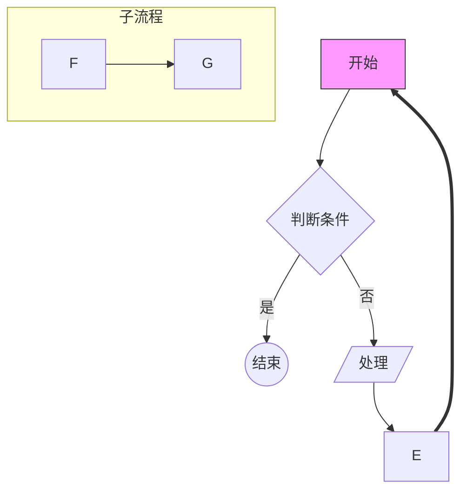

### 2. 时序图 (Sequence Diagram)

**用途**: 描述对象间交互顺序

**关键元素**:
- `participant` 定义参与者
- `->>` 发送消息
- `-->>` 返回消息
- `activate/deactivate` 激活/停用
- `alt/else/end` 条件分支

**示例**:
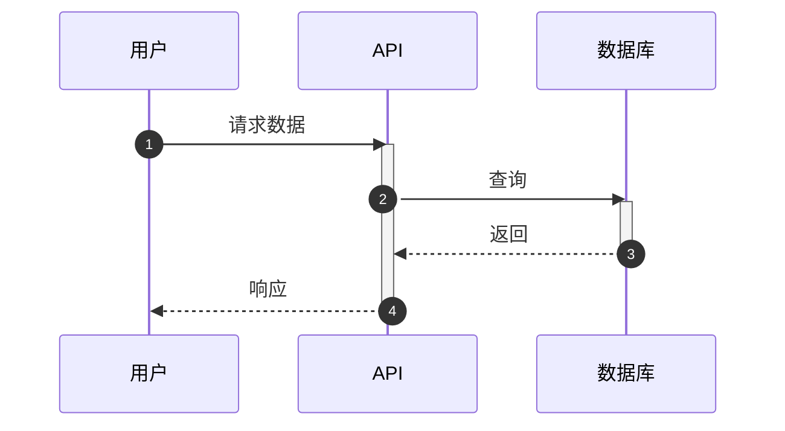

### 3. 类图 (Class Diagram)

**用途**: 展示类、属性、方法及关系

**关系符号**:
- `<|--` 继承
- `--*` 组合
- `--o` 聚合
- `--` 关联

**示例**:
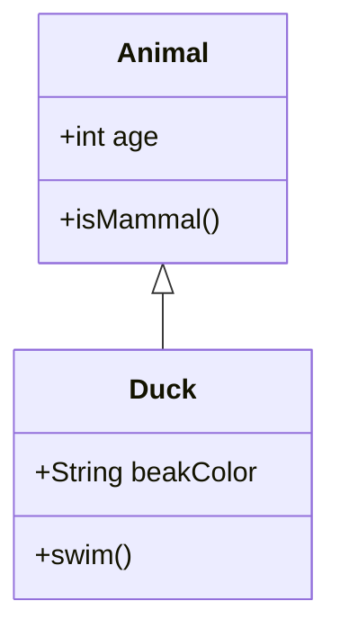

### 4. 状态图 (State Diagram)

**用途**: 描述状态转换

**示例**:
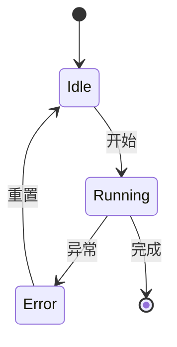

### 5. 实体关系图 (ERD)

**用途**: 数据库建模

**基数表示**:
- `||--o{` 一对多
- `||--|{` 一对一或多
- `}|..|{` 多对多

**示例**:
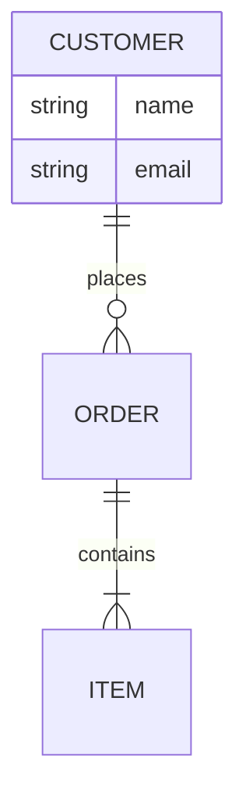

### 6. 甘特图 (Gantt Chart)

**用途**: 项目进度管理

**示例**:
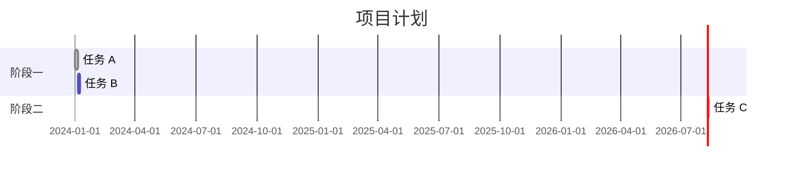

### 7. 饼图 (Pie Chart)

**用途**: 展示占比

**示例**:
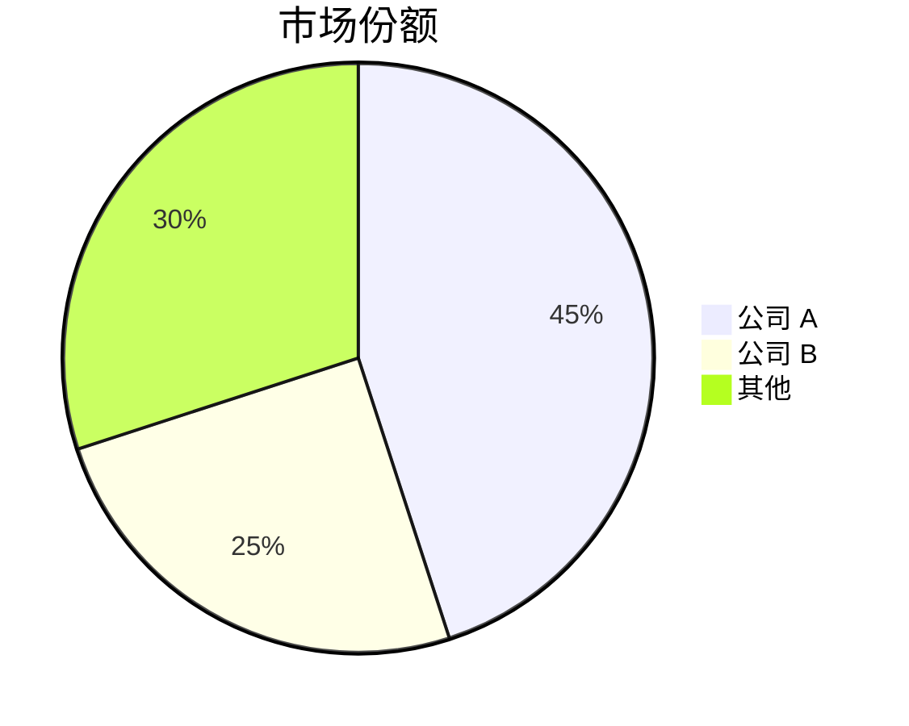

### 8. 思维导图 (Mindmap)

**用途**: 树状结构展示概念

**示例**:
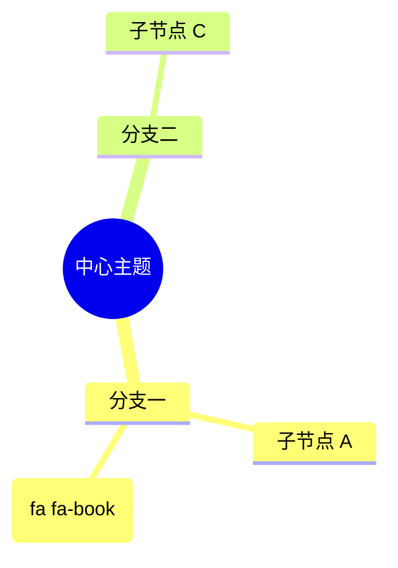

### 9. 时间线图 (Timeline)

**用途**: 按时间顺序展示事件

**示例**:
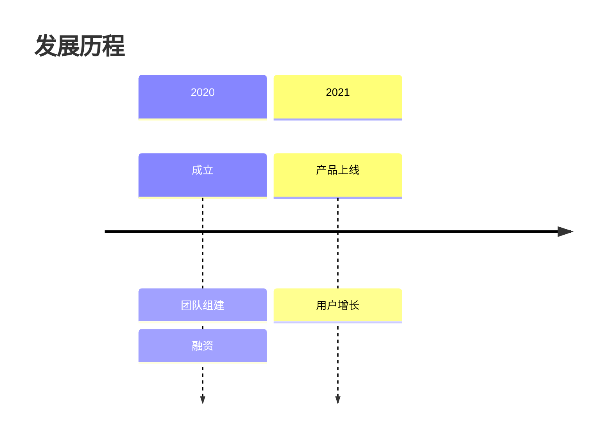

### 10. Git 提交图 (GitGraph)

**用途**: 模拟 Git 分支历史

**示例**:
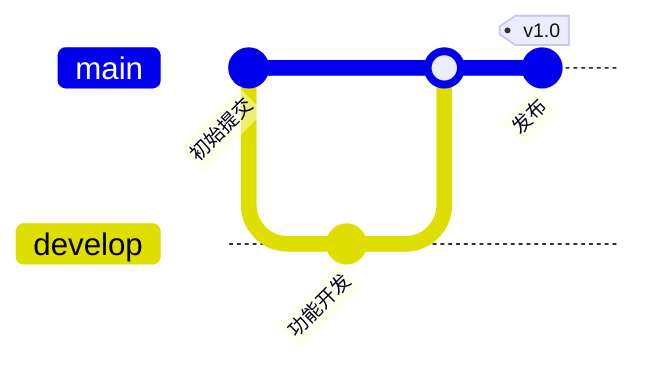

## 高级图表类型

### 11. 桑基图 (Sankey)

展示流量、能量或数据流向

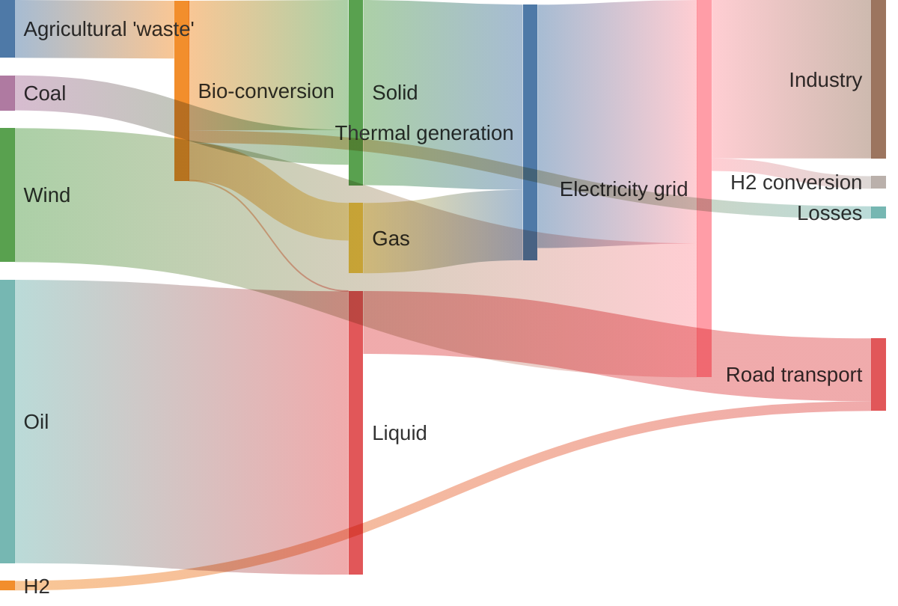

### 12. XY 图表 (XY Chart)

折线图、柱状图

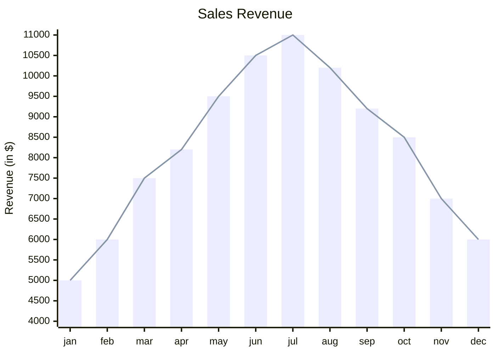

### 13. 块图 (Block Diagram)

系统架构块图

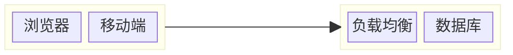

### 14. 雷达图 (Radar)

多维数据对比

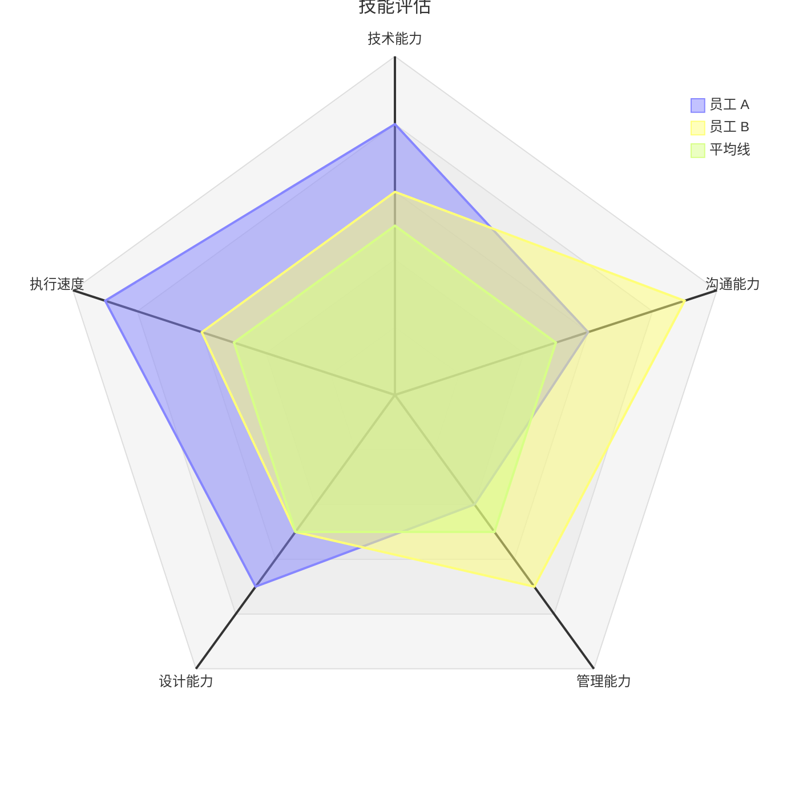

### 15. 看板图 (Kanban)

任务管理看板


### 16. 架构图 (Architecture)

云架构图

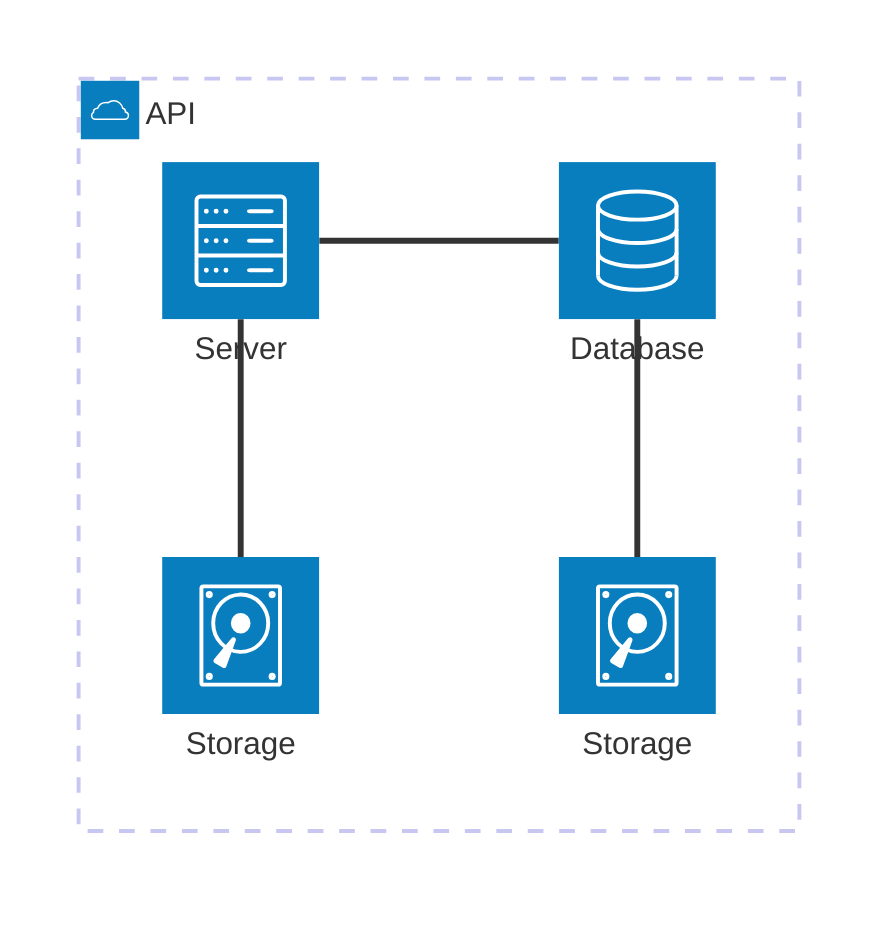

### 17. 包图 (Packet)

网络数据包结构

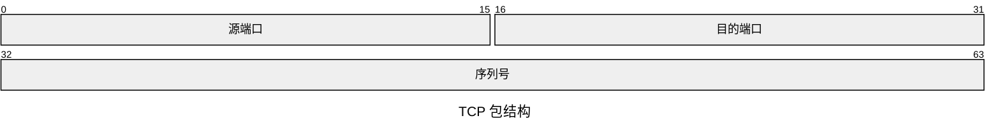

### 18. 象限图 (Quadrant Chart)

四象限分析


### 19. 需求图 (Requirement Diagram)

系统工程需求

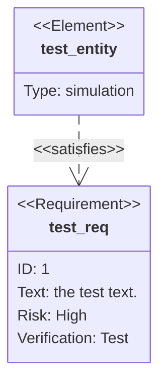

### 20. 用户旅程图 (Journey)

用户体验旅程

```mermaid
journey
    title 购物旅程
    section 浏览
      搜索商品：5: 用户
      查看详情：4: 用户
    section 购买
      下单支付：3: 用户
```

### 21. ZenUML

高级时序图

```mermaid
zenuml
    title 订单服务
    @Actor 用户
    @Boundary 控制器
    @EC2 服务层
    用户 -> 控制器：请求
    控制器 -> 服务层：处理
```

### 22. 树状图 (Treemap)

层级数据占比

```mermaid
treemap-beta
"分类 A"
    "子项 A.1": 12
    "子项 A.2": 15
"分类 B"
    "子项 B.1": 20
```

## 绘图最佳实践

### 1. 选择合适的图表类型

- **流程/逻辑**: 流程图
- **交互/调用**: 时序图
- **结构/关系**: 类图、ERD
- **进度/时间**: 甘特图、时间线
- **占比/分布**: 饼图、桑基图、树状图
- **对比/分析**: 雷达图、象限图
- **架构/部署**: 块图、架构图

### 2. 保持简洁清晰

- 节点数量控制在合理范围（流程图建议不超过 15 个节点）
- 避免过多交叉连线
- 使用子图分组相关元素
- 添加适当的注释和标签

### 3. 样式与美化

**基础样式语法**:
```
style 节点名 fill:#颜色，stroke:#边框色，stroke-width:宽度
```

**示例**:
```mermaid
flowchart TD
    A[节点] --> B[节点]
    style A fill:#f9f,stroke:#333,stroke-width:2px
    style B fill:#ff9,stroke:#f66,stroke-width:1px
```

**注意**: 样式语句中的标点符号必须使用英文逗号 (,) 和冒号 (:),不能使用中文标点。

**颜色推荐**:
- 柔和色系：`#e1f5fe`(浅蓝), `#ffebee`(浅红), `#e8f5e9`(浅绿)
- 强调色：`#f9f`(粉红), `#ff9`(黄色)

### 4. 中文支持

所有图表类型都支持中文标签和注释，直接使用即可。

### 5. 调试技巧

1. 从简单示例开始，逐步添加复杂度
2. 使用 [Mermaid Live Editor](https://mermaid.live/) 实时预览
3. 检查语法错误（括号匹配、冒号、逗号）
4. 复杂布局可尝试调整节点顺序

## 常见错误及解决方案

### 错误 1: 图表不渲染

**原因**: 代码块标识符错误
**解决**: 确保使用 \`\`\`mermaid 而非 \`\`\`

### 错误 2: 连线错乱

**原因**: 节点定义顺序问题
**解决**: 调整节点定义顺序或使用隐形连接 `~~~`

### 错误 3: 样式不生效

**原因**: 样式语句拼写错误或节点名不匹配
**解决**: 检查 style 语句中的节点名与定义完全一致

### 错误 4: 特殊字符报错

**原因**: 包含未转义的特殊字符
**解决**: 使用引号包裹包含特殊字符的文本 `"文本"`

## 快速选择指南

根据需求选择图表:

**展示流程步骤？** → 流程图
**展示调用关系？** → 时序图
**展示数据结构？** → 类图/ERD
**展示时间规划？** → 甘特图
**展示占比分布？** → 饼图/桑基图
**展示发展历程？** → 时间线
**展示版本历史？** → Git 图
**展示系统架构？** → 块图/架构图
**展示能力对比？** → 雷达图
**展示任务状态？** → 看板图
**展示网络协议？** → 包图
**展示决策分析？** → 象限图

## 参考资源

- 官方文档：https://mermaid.js.org/
- 在线编辑器：https://mermaid.live/
- 示例库：https://mermaid.js.org/intro/examples.html
