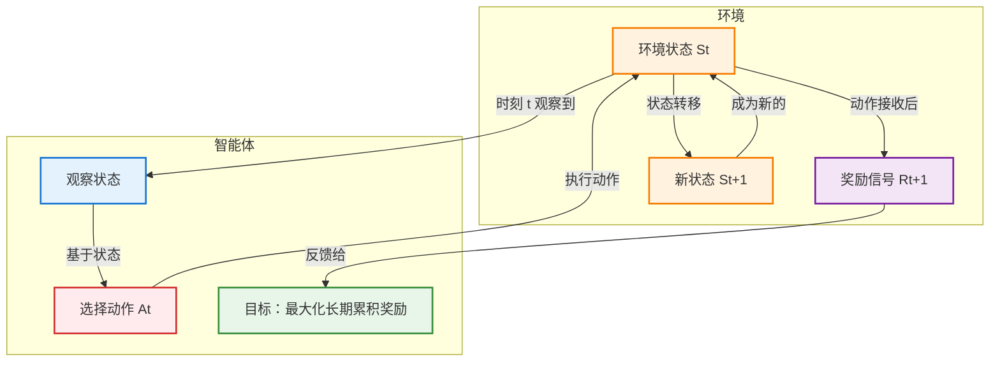

# 强化学习基础概念

## 序贯决策（Sequential Decision Making）

在多个时间步骤或阶段中，决策者（或智能体）根据当前状态和可用信息，逐步做出一系列<mark>相互关联</mark>的决策的过程。

与"一次性决策"不同，序贯决策的核心在于**<mark>动态</mark>性**和**<mark>连续</mark>性**：今天的决定会改变明天的环境，从而影响未来的选择。这一概念是**强化学习（Reinforcement Learning, RL）**、运筹学、控制理论和经济学等领域的基石。

### 核心定义与本质

序贯决策任务通常被建模为一个智能体（Agent）与环境（Environment）持续交互的过程：

- **输入**：智能体在时刻 $t$ 观察到环境的状态 $S_t$
- **动作**：基于状态，<mark>智能体选择一个动作</mark> $A_t$
- **反馈**：<mark>环境</mark>接收动作后，转移到<mark>新状态</mark> $S_{t+1}$，并给出一个<mark>标量奖励信号</mark> $R_{t+1}$
- **目标**：智能体的目标不是最大化当前的即时奖励，而是<mark>最大化**长期累积奖励**</mark>（Cumulative Reward），通常称为回报（Return）

> **关键区别**：在有监督学习中，模型主要进行"预测"（如分类、回归），数据通常是<mark>独立同分布</mark>的；而在序贯决策中，模型进行"决策"，数据是<mark>序列相关</mark>的，且**智能体的<mark>动作会直接改变未来数据的分布</mark>**。

| 维度 | 有监督学习 | 序贯决策 |
|------|-----------|----------|
| **任务类型** | 预测（分类、回归） | 决策 |
| **数据特性** | 独立同分布 (i.i.d.) | 序列相关 |
| **数据收集方式** | 预先收集的静态数据集 | 通过与环境交互动态生成 |
| **反馈信号** | 标签（正确答案） | 奖励信号（标量，可能延迟） |
| **目标** | 最小化预测误差 | 最大化长期累积奖励 |
| **评估标准** | 准确率、精确率、召回率等 | 累积回报、胜率等 |
| **典型应用** | 图像分类、垃圾邮件过滤 | 游戏 AI、机器人控制、自动驾驶 |

### 四大核心特征

序贯决策任务具有以下显著特点，使其比静态决策更复杂：

1. **动态性 (Dynamicity)**  
   系统状态随时间变化。决策者不能只看眼前，必须考虑动作对后续状态的演化影响。

2. **依赖性 (Dependency)**  
   当前决策依赖于过去的历史（状态轨迹），同时当前的决策又决定了未来的可能性。这是一个连锁反应过程。

3. **不确定性 (Uncertainty)**  
   未来往往是不确定的。动作的结果可能受随机因素干扰（例如：机器人执行"前进"指令可能因打滑而未到达预期位置）。因此，决策通常基于概率模型。

4. **延迟奖励 (Delayed Reward)**  
   这是最棘手的部分。一个动作的好坏可能不会立即显现，需要经过很多步之后才能看到最终结果（例如：围棋中的某一步弃子，可能在几十手后才体现出优势）。这导致了**信用分配问题（Credit Assignment Problem）**：究竟是哪一步决策导致了最终的成功或失败？

### 数学建模：马尔可夫决策过程 (MDP)

在人工智能和强化学习中，序贯决策任务最标准的数学框架是**马尔可夫决策过程 (Markov Decision Process, MDP)**。一个 MDP 由五元组 $(S, A, P, R, \gamma)$ 定义：

- **$S$ (State)**：状态空间，所有可能环境的集合
- **$A$ (Action)**：动作空间，智能体可执行的操作集合
- **$P$ (Transition Probability)**：状态转移概率 $P(s'|s, a)$，表示在状态 $s$ 执行动作 $a$ 后转移到 $s'$ 的概率
- **$R$ (Reward Function)**：奖励函数 $R(s, a, s')$，表示执行动作后获得的即时收益
- **$\gamma$ (Discount Factor)**：折扣因子 ($0 \le \gamma \le 1$)，用于衡量未来奖励的重要性。$\gamma$ 越接近 0，智能体越短视；越接近 1，越重视长远利益

**目标函数**：  
寻找一个策略 $\pi(a|s)$（即在状态 $s$ 下选择动作 $a$ 的概率分布），使得期望累积回报最大化：

$$ G_t = \sum_{k=0}^{\infty} \gamma^k R_{t+k+1} $$

### 主要方法

针对不同的场景和信息完备程度，有多种解决方法：

- **动态规划 (Dynamic Programming, DP)** <mark>全知，，可以无限推导</mark>
  - **适用前提：已知完整的模型**
    - 所谓"完整的模型"是指完全掌握马尔可夫决策过程 (MDP) 的所有要素：
      - **状态转移概率 $P$**：$P(s'|s, a)$ 表示在状态 $s$ 执行动作 $a$ 后，转移到状态 $s'$ 的概率。这描述了环境的动态特性，即"如果我在这里做这个动作，有多大可能性会到哪里去"
      - **奖励函数 $R$**：$R(s, a, s')$ 或 $R(s, a)$ 表示在状态 $s$ 执行动作 $a$（并转移到 $s'$）后获得的即时奖励。这描述了环境对智能体行为的反馈机制
    - 这意味着智能体拥有环境的"上帝视角"说明书，无需通过试错来探索环境结构
  
  - **核心机制：基于贝尔曼方程的迭代**
    - 贝尔曼方程揭示了一个状态价值的递归结构：**当前状态的价值 = 即时奖励 + 未来折扣价值**
    - 贝尔曼最优方程形式：
      $$V(s) = \max_a \sum_{s'} P(s'|s,a) [R(s,a,s') + \gamma V(s')]$$
    - 方程含义：在状态 $s$ 的最优价值等于选择某个动作 $a$ 后，考虑所有可能的下一状态 $s'$ 的期望回报，并选择能带来最大价值的动作
    - **自举 (Bootstrapping) 特性**：用后续状态的估计值来更新当前状态的估计值，这是 DP 的灵魂
    - 主要算法：
      - **策略迭代 (Policy Iteration)**：交替进行策略评估（计算当前策略的价值函数）和策略改进（根据价值函数优化策略），直到策略收敛
      - **价值迭代 (Value Iteration)**：直接使用贝尔曼最优方程迭代，当价值函数 $V^*$ 收敛后提取最优策略 $\pi^*$
  
  - **缺点：维数灾难 (Curse of Dimensionality)**
    - 每次迭代需遍历所有状态 $S$ 和动作 $A$，单次迭代复杂度约为 $O(|S|^2 |A|)$
    - 当状态由多个变量组成时，状态空间随维度呈指数级膨胀。例如：10 个关节的机器人，每个关节 100 个角度，总状态数为 $100^{10} = 10^{20}$
    - 这使得 DP 在高维连续状态空间（如图像输入、复杂机器人控制）中完全失效
  
  > **规划而非学习**：智能体可以在不实际与环境交互的情况下，仅在脑海中进行"模拟"和计算，通过对贝尔曼方程的数学迭代，将全局最优解"传播"到每一个状态，从而推导出最优策略。这被称为**规划（Planning）**，区别于通过试错进行的**学习（Learning）**

- **蒙特卡洛方法 (Monte Carlo Methods)** <mark>需要完整模拟所有路径，即知道执行结果反推轨迹价值</mark>
  - **核心机制：无需模型，基于采样**
    - 完全不需要知道环境的数学模型（$P$ 和 $R$），只关心**实际发生了什么**
    - **如何估算价值**：基于大数定律，通过大量采样来逼近期望值
      - 智能体与环境交互，记录从开始到结束的完整过程（称为**轨迹**或**Episode**）
      - 对于某个状态 $s$，统计所有访问过该状态的轨迹，计算这些轨迹中从 $s$ 开始直到结束所获得的**实际回报（Return, $G_t$）的平均值**
      - 公式：$V(s) \approx \frac{1}{N(s)} \sum_{i=1}^{N(s)} G_t^{(i)}$，其中 $N(s)$ 是访问次数，$G_t$ 是实际获得的累积折扣奖励
    - **与 DP 的本质区别**：MC 使用**真实发生的后续回报**更新价值，而不是用“下一步的估计值”更新“当前值”（即**没有自举 Bootstrapping**）
  
  - **为什么必须是回合制任务 (Episodic Tasks)**
    - **回合制任务的定义**：有明确的**开始状态**和**终止状态**的任务
      - 例子：一局围棋（从落子开始到分出胜负）、走迷宫（从入口到出口或撞墙）、一次机器人抓取尝试
      - 时间步 $t$ 会在某个时刻 $T$ 终止，然后环境重置，开始新的回合
    - **MC 依赖完整回报 $G_t$**：
      $$G_t = R_{t+1} + \gamma R_{t+2} + \dots + \gamma^{T-1} R_T$$
      注意公式中的 $T$（终止时刻）。MC **必须**等到一个回合彻底结束（游戏通关、游戏失败、任务完成），才能计算出完整的 $G_t$
    - **持续性任务的困境**：如果任务没有终点（如控制恒温器永远运行），则 $T \to \infty$，无法计算完整的 $G_t$，MC 方法失效
  
  - **优缺点分析**
    - **优点**：
      - 简单直观，逻辑符合人类直觉（"试得多了，平均结果就是真实水平"）
      - 无需建模，可直接应用于黑盒环境
      - 无偏差收敛：只要采样次数足够多，保证收敛到真实的价值函数 $V_\pi$
      - 并行友好：每个回合独立，易于并行生成大量轨迹加速学习
    - **缺点**：
      - **高方差**：依赖单次采样的完整轨迹，运气好坏会导致价值估计波动大
      - **只能用于回合制**：无法直接处理没有终点的长期持续任务
      - **样本效率低**：必须等到回合结束才能学习，学习信号延迟严重
      - **探索问题**：从不访问的状态永远无法更新（需结合 $\epsilon$-greedy 等探索策略）
  
  > **实际应用示例**：训练 AI 玩《超级马里奥》时，MC 让 AI 随机玩一局游戏并记录所有步骤，游戏结束后计算总分，回溯这一局经过的所有状态并根据实际总分更新这些状态的价值。重复玩几千局后，平均值越来越接近真实的通关概率或得分期望。

- **时序差分学习 (Temporal Difference, TD)** <mark>根据当前的观察与下一步的预测，更新当前步骤的评分，影响下一次智能体遇到步骤时的选择</mark>
  - **核心思想：DP 与 MC 的"完美混血儿"**
    - **像 MC 一样无需模型 (Model-Free)**：不需要知道环境的状态转移概率 $P$ 和奖励函数 $R$，完全通过与环境的实际交互（采样）来学习，可直接应用于黑盒环境
    - **像 DP 一样自举 (Bootstrapping)**：不需要等到回合结束，在每一步利用当前对下一步价值的估计来更新当前的价值。依赖的是即时奖励 + 下一状态的估计价值 $(R_{t+1} + \gamma V(S_{t+1}))$，而非真实的完整回报 $G_t$
  
  - **核心机制：TD 误差 (TD Error)**
    - TD 学习的更新动力来自于衡量"现在的预测"和"更好的预测"之间的差距
    - 状态价值函数更新公式：
      $$V(S_t) \leftarrow V(S_t) + \alpha \cdot [R_{t+1} + \gamma V(S_{t+1}) - V(S_t)]$$
      其中 TD 误差 $\delta_t = R_{t+1} + \gamma V(S_{t+1}) - V(S_t)$
    - **直观理解**：$R_{t+1} + \gamma V(S_{t+1})$ 是 TD 目标（基于最新观察构建的更准确估计），$V(S_t)$ 是当前旧估计，$\alpha$ 是学习率。每走一步就可以立即更新上一步的认知，无需等待最终结果
    - **关键优势**：
      - **在线学习 (Online Learning)**：任务进行中实时学习，无需等待结局
      - **适用于持续任务**：可处理没有终点的无限时长任务 (Continuing Tasks)
      - **低方差**：只依赖单步真实奖励，减少了长轨迹中随机性带来的累积误差
  
  - **代表算法**
    - **(1) Q-Learning (Off-Policy / 异策略)**
      - **核心思想**：学习最优策略的价值，不管智能体当前实际上是怎么探索的
      - **更新公式**：$Q(S_t, A_t) \leftarrow Q(S_t, A_t) + \alpha [R_{t+1} + \gamma \max_a Q(S_{t+1}, a) - Q(S_t, A_t)]$
      - **特点**：计算 TD 目标时假设下一步会选择能让 $Q$ 值最大的动作，即使实际探索时选了别的动作（如 $\epsilon$-greedy 随机探索）
      - **Off-Policy**：<mark>行为策略（用来探索的）和目标策略（用来学习的）可以不同</mark>
      - **优势**：倾向于直接学习最优路径，是 Deep Q-Network (DQN) 的基础
      - **缺点**：在噪声大的环境中可能存在最大化偏差 (Maximization Bias)，高估价值
    
    - **(2) SARSA (On-Policy / 同策略)**
      - **名字来源**：State, Action, Reward, Next State, Next Action
      - **核心思想**：学习的是当前正在执行的策略的价值
      - **更新公式**：$Q(S_t, A_t) \leftarrow Q(S_t, A_t) + \alpha [R_{t+1} + \gamma Q(S_{t+1}, A_{t+1}) - Q(S_t, A_t)]$
      - **特点**：使用智能体在 $S_{t+1}$ 实际选择的动作 $A_{t+1}$ 的 $Q$ 值
      - **On-Policy**：行为策略和目标策略必须是同一个
      - **优势**：更保守、更安全，考虑了探索带来的风险
      - **缺点**：收敛到的策略依赖于探索方式
    
    - **场景举例：悬崖行走 (Cliff Walking)**
      - 环境：网格世界，起点左下，终点右下，中间有"悬崖"，掉下去奖励 -100，每步奖励 -1
      - **Q-Learning**：学到紧贴悬崖边缘的最短路径（理论上最优），但训练时会因随机探索经常掉下悬崖
      - **SARSA**：学到远离悬崖的安全路径，因为它考虑了"我下一步可能会随机乱走掉下去"的风险
  
  > 直观理解：
  >
  > 如果你原本以为这个状态值 10 分 (V(S_t)=10)。
  >
  > 走一步后，你拿到了 2 分奖励 (R=2)，且发现下一个状态看起来值 9 分 (V(S_{t+1})=9)，折扣因子 gamma=1。
  >
  > 那么新的目标值是 2 + 9 = 11。
  >
  > TD 误差是 11 - 10 = +1。
  >
  > 你会把原估计值往 11 的方向调整一点（比如调整 0.1，变成 10.1）。

- **深度强化学习 (Deep Reinforcement Learning, Deep RL)** <mark>将决策经验训练到神经网络中，然后代替决策函数进行决策</mark>
  - **核心驱动力：为什么需要"深度"？**
    - **传统表格型方法的困境**：当状态空间极大时，无法创建存储所有状态的表格
      - 围棋：状态数约 $10^{170}$
      - Atari 游戏图像（$84 \times 84$ 像素）：状态数约 $256^{7056}$，比宇宙原子总数还大
      - **结论**：不可能遍历所有状态来更新它们
    
    - **深度学习的解决方案：函数近似 (Function Approximation)**
      - 不再存储每个状态的具体数值，而是训练深度神经网络，参数为 $\theta$
      - 网络作为函数拟合器：$Q(s, a; \theta) \approx Q^*(s, a)$ 或 $\pi(a|s; \theta) \approx \pi^*(a|s)$
      - **泛化能力 (Generalization)**：最关键的优势。如果见过"左上角有个敌人"，遇到"左上角稍微偏下的敌人"时，即使从未见过这个确切状态，也能根据相似性推断出大致的价值或策略
      - 这使得处理连续、高维状态成为可能
  
  - **两大主流流派**
    - **(A) 基于价值的方法 (Value-Based Methods)** <mark>衡量某个动作的未来得分</mark>
      - **目标**：用神经网络近似动作价值函数 $Q(s, a)$
      - **策略获取**：通过贪心策略选择 $Q$ 值最大的动作 ($\arg\max_a Q(s, a)$)
      - **代表算法**：**DQN (Deep Q-Network)** 及其变体 (Double DQN, Dueling DQN)
      - **特点**：通常只能处理离散动作空间；训练相对稳定，但可能收敛到次优解
    
    - **(B) 基于策略的方法 (Policy-Based Methods)** <mark>衡量各个动作的选择概率</mark>
      - **目标**：用神经网络直接近似策略函数 $\pi(a|s)$，输出动作的概率分布
      - **价值获取**：通常学习一个辅助的价值函数 $V(s)$ 来减少方差（即 Actor-Critic 架构）
      - **代表算法**：**PPO (Proximal Policy Optimization)**, A3C, TRPO
      - **特点**：可以直接处理**连续动作空间**（如机器人关节角度、方向盘转角）；能够学习随机策略；通常收敛更快，但训练可能不稳定
    
    - **(C) 演员 - 评论家架构 (Actor-Critic)**
      - 结合上述两者：
        - **Actor (演员)**：策略网络，负责根据状态输出动作
        - **Critic (评论家)**：价值网络，负责评估 Actor 的动作好不好（计算 TD Error），指导 Actor 更新
      - PPO 和 A3C 都属于这一类
  
  - **代表算法详解**
    - **(1) DQN (Deep Q-Network) - 里程碑之作**
      - **背景**：2015 年 DeepMind 提出，首次证明 RL+DL 可以在 Atari 游戏上达到超越人类的水平
      - **核心机制**：
        - 输入：原始像素图像
        - 输出：每个可能动作的 Q 值
        - **两大创新技巧**（解决训练不稳定的关键）：
          - **经验回放 (Experience Replay)**：将智能体的经历 $(s, a, r, s')$ 存入缓冲区，训练时随机采样。打破数据间的相关性，使数据更像独立同分布 (IID)，适合深度学习
          - **目标网络 (Target Network)**：使用两个网络，一个用于预测 (Online Net)，一个用于计算目标值 (Target Net)。Target Net 的参数定期从 Online Net 复制，保持短期稳定，避免"追逐自己的尾巴"导致的发散
      - **局限**：只能处理离散动作；容易高估 Q 值
    
    - **(2) PPO (Proximal Policy Optimization) - 工业界首选**
      - **背景**：2017 年 OpenAI 提出，目前应用最广泛的通用 RL 算法之一
      - **核心机制**：
        - 属于 **Actor-Critic** 架构
        - **核心创新：截断代理目标 (Clipped Surrogate Objective)**
          - 在更新策略时，限制新策略与旧策略的差异不能太大（通过 `clip` 操作）
          - 如果新策略比旧策略好太多，更新幅度会被截断；如果变差了，则不接受更新
        - **优势**：
          - **极其稳定**：避免了策略更新步长过大导致性能崩塌的问题
          - **样本效率高**：可以使用同一批数据进行多次梯度下降更新
          - **实现简单**：相比其前身 TRPO（需要复杂的二阶优化），PPO 只需一阶梯度
      - **应用**：机器人控制、游戏 AI (如 OpenAI Five 玩 Dota2)、大语言模型对齐 (RLHF)
    
    - **(3) AlphaGo / AlphaZero - 规划与学习的结合**
      - **背景**：DeepMind 开发，击败人类围棋冠军
      - **特殊性**：它不仅仅是纯粹的 Deep RL，而是 **Deep RL + 蒙特卡洛树搜索 (MCTS)** 的结合
        - **策略网络 (Policy Net)**：缩小搜索范围，只考虑高概率的落子点（像人类直觉）
        - **价值网络 (Value Net)**：快速评估当前棋局的胜率，不用下到终局（像人类大局观）
        - **MCTS**：利用上述两个网络进行模拟推演，选出最优一步
      - **意义**：证明了在拥有完美模型（围棋规则已知）的复杂环境中，将深度学习的感知/直觉与经典搜索算法结合，可以达到超人类水平。AlphaZero 进一步去除了人类棋谱依赖，完全通过自我对弈 (Self-Play) 从零开始学习

这是一个基于我们之前讨论的四种强化学习核心方法（**动态规划 DP**、**蒙特卡洛 MC**、**时序差分 TD**、**深度强化学习 Deep RL**）的详细对比表格。

这个表格涵盖了从理论基础到实际应用的各个维度，帮助你一目了然地看清它们的区别与联系。

### 强化学习四大核心方法对比表

| 维度 | **动态规划 (DP)** | **蒙特卡洛 (MC)** | **时序差分 (TD)** | **深度强化学习 (Deep RL)** |
| :--- | :--- | :--- | :--- | :--- |
| **核心定义** | 基于模型的规划方法 | 基于采样的无模型方法 | 结合采样与自举的无模型方法 | 使用神经网络近似价值/策略的 RL |
| **是否需要模型**($P, R$) | **需要** (必须已知完整模型) | **不需要** (Model-Free) | **不需要** (Model-Free) | **不需要** (通常 Model-Free) |
| **更新时机** | 同步/异步迭代 (无需交互) | **回合结束后** (必须完整轨迹) | **单步更新** (每走一步即可更新) | 单步或回合结束 (取决于具体算法) |
| **核心机制** | **自举 (Bootstrapping)**用估计值更新估计值 | **真实回报**用实际采样总和更新 | **自举 + 采样**用即时奖励+下一步估计更新 | **函数近似 (Function Approximation)**用神经网络拟合 Q 值或 $\pi$ |
| **偏差 (Bias)** | **有偏差** (依赖模型准确性) | **无偏差** (收敛于真值) | **有偏差** (依赖初始估计) | **有偏差** (依赖网络结构与初始化) |
| **方差 (Variance)** | **低** (确定性计算) | **高** (受整条轨迹随机性影响大) | **中/低** (仅受单步随机性影响) | **高** (受采样、网络初始化、超参影响) |
| **适用任务类型** | 任意 (回合制 / 持续任务) | **仅限回合制** (Episodic) | **任意** (回合制 / 持续任务) | **任意** (尤其擅长高维连续任务) |
| **状态空间处理** | **表格型** (显式存储每个状态) | **表格型** (显式存储访问过的状态) | **表格型** (显式存储访问过的状态) | **函数近似** (泛化到未见过的状态) |
| **维数灾难** | **严重** (状态多则无法计算) | **严重** (状态多则无法遍历) | **严重** (状态多则无法遍历) | **解决** (通过泛化处理高维状态) |
| **样本效率** | N/A (不需要采样，只需计算) | **低** (需大量完整回合) | **中高** (单步利用信息，收敛快) | **低** (通常需要海量交互数据) |
| **计算复杂度** | $O(|S|^2|A|)$ 每次迭代 | $O(1)$ 每次更新 (但需等待回合) | $O(1)$ 每次更新 | 高 (需进行反向传播梯度下降) |
| **典型算法** | 策略迭代 (Policy Iteration)价值迭代 (Value Iteration) | 蒙特卡洛控制First-visit / Every-visit MC | **Q-Learning** (Off-policy)**SARSA** (On-policy) | **DQN** (Value-based)**PPO**, A3C (Policy-based)**AlphaGo** (RL+Search) |
| **主要优点** | 理论完备，能找到全局最优解 | 简单直观，无模型，无偏差 | 在线学习，收敛快，方差较低 | 能处理图像/传感器等高维输入，泛化能力强 |
| **主要缺点** | 需要已知模型，无法应对大状态空间 | 只能用于回合制，方差大，收敛慢 | 有偏差，超参数敏感 | 训练不稳定，样本效率低，调参难 (“黑艺术”) |
| **应用场景** | 小规模网格世界已知规则的简单博弈 | 简单的回合制游戏模拟环境中的策略评估 | 机器人基础控制简单的导航任务 | **自动驾驶****复杂游戏 (Atari, Go, Dota2)****机器人精细操作****推荐系统** |

---

### 逻辑演进总结

为了更深刻地理解它们的关系，可以将它们看作是一个**不断放宽限制、增强能力**的演进过程：

1.  **DP (基石)**：
    *   **假设**：世界是完全已知的 ($P, R$)。
    *   **局限**：现实世界未知且状态太多。
    *   **贡献**：提出了**贝尔曼方程**和**自举**思想。

2.  **MC (突破模型限制)**：
    *   **改进**：不再需要知道 $P, R$，通过**采样**学习。
    *   **局限**：必须等到结局才能学习，方差大，不能处理持续任务。
    *   **贡献**：证明了无模型学习的可行性。

3.  **TD (突破时间与方差限制)**：
    *   **改进**：结合了 DP 的**自举**和 MC 的**采样**。不用等结局，单步即可更新，方差更低。
    *   **局限**：仍然是表格型方法，无法处理像图像这样的高维状态（维数灾难）。
    *   **贡献**：成为了现代 RL 的核心更新规则 (Q-Learning, SARSA)。

4.  **Deep RL (突破状态空间限制)**：
    *   **改进**：用**深度神经网络**替换了表格。解决了维数灾难，能处理像素、语音等高维输入。
    *   **代价**：引入了训练不稳定性、样本效率低等新问题。
    *   **贡献**：让强化学习真正走出了仿真小环境，进入了复杂的现实世界应用。

### 如何选择？

*   如果你有一个**小型的、规则完全已知**的问题（如简单的迷宫求解器）：选 **DP**。
*   如果你有一个**回合制**问题，且**不在乎方差**，想要最简单的实现：选 **MC**。
*   如果你需要一个**通用、高效、在线**的学习算法，且状态空间是**离散且较小**的：选 **TD (Q-Learning/SARSA)**。
*   如果你的输入是**图像、传感器数据**，或者状态空间**巨大/连续**：必须选 **Deep RL (DQN/PPO/SAC)**。