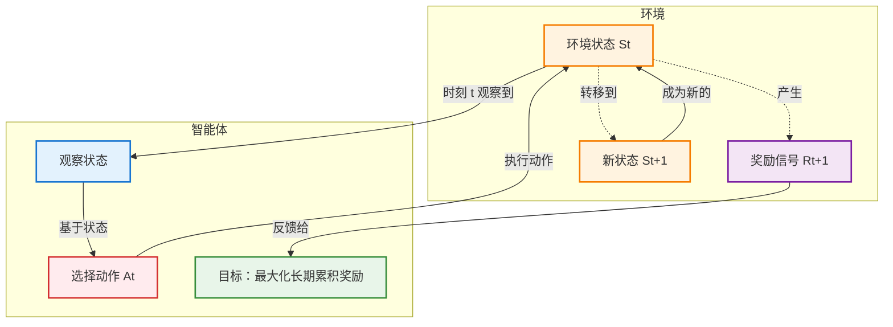
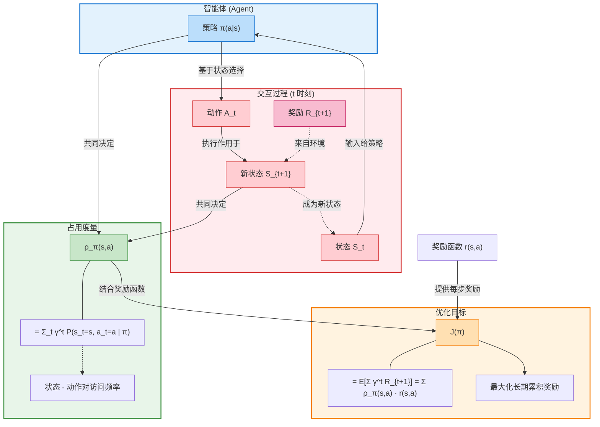

# 强化学习基础概念

深度学习追求的是极致的函数拟合，而强化学习追求的是最优决策
- 强化学习可以利用深度学习的经验来加强决策
- 深度学习也可以直接拟合强化学习的决策过程

实践是检验真理的唯一标准，真理是指导实践的指南；环境反馈是检验策略的最终依据，策略优化是推动智能进化的关键动力

## 序贯决策（Sequential Decision Making）

在多个时间步骤或阶段中，决策者（或智能体）根据当前状态和可用信息，逐步做出一系列<mark>相互关联</mark>的决策的过程。

与"一次性决策"不同，序贯决策的核心在于**<mark>动态</mark>性**和**<mark>连续</mark>性**：今天的决定会改变明天的环境，从而影响未来的选择。这一概念是**强化学习（Reinforcement Learning, RL）**、运筹学、控制理论和经济学等领域的基石。

### 核心定义与本质

序贯决策任务通常被建模为一个智能体（Agent）与环境（Environment）持续交互的过程：

- **输入**：智能体在时刻 $t$ 观察到环境的状态 $S_t$
- **动作**：基于状态，<mark>智能体选择一个动作</mark> $A_t$
- **反馈**：<mark>环境</mark>接收动作后，转移到<mark>新状态</mark> $S_{t+1}$，并给出一个<mark>标量奖励信号</mark> $R_{t+1}$
- **目标**：智能体的目标不是最大化当前的即时奖励，而是<mark>最大化**长期累积奖励**</mark>（Cumulative Reward），通常称为回报（Return）



> **关键区别**：在有监督学习中，模型主要进行"预测"（如分类、回归），数据通常是<mark>独立同分布</mark>的；而在序贯决策中，模型进行"决策"，数据是<mark>序列相关</mark>的，且**智能体的<mark>动作会直接改变未来数据的分布</mark>**。

| 维度 | 有监督学习 | 序贯决策 |
|------|-----------|----------|
| **任务类型** | 预测（分类、回归） | 决策 |
| **数据特性** | 独立同分布 (i.i.d.) | 序列相关 |
| **数据收集方式** | 预先收集的静态数据集 | 通过与环境交互动态生成 |
| **反馈信号** | 标签（正确答案） | 奖励信号（标量，可能延迟） |
| **目标** | 最小化预测误差 | 最大化长期累积奖励 |
| **评估标准** | 准确率、精确率、召回率等 | 累积回报、胜率等 |
| **典型应用** | 图像分类、垃圾邮件过滤 | 游戏 AI、机器人控制、自动驾驶 |

### 四大核心特征

序贯决策任务具有以下显著特点，使其比静态决策更复杂：

1. **动态性 (Dynamicity)**  
   系统状态随时间变化。决策者不能只看眼前，必须考虑动作对后续状态的演化影响。

2. **依赖性 (Dependency)**  
   当前决策依赖于过去的历史（状态轨迹），同时当前的决策又决定了未来的可能性。这是一个连锁反应过程。

3. **不确定性 (Uncertainty)**  
   未来往往是不确定的。动作的结果可能受随机因素干扰（例如：机器人执行"前进"指令可能因打滑而未到达预期位置）。因此，决策通常基于概率模型。

4. **延迟奖励 (Delayed Reward)**  
   这是最棘手的部分。一个动作的好坏可能不会立即显现，需要经过很多步之后才能看到最终结果（例如：围棋中的某一步弃子，可能在几十手后才体现出优势）。这导致了**信用分配问题（Credit Assignment Problem）**：究竟是哪一步决策导致了最终的成功或失败？

### 数学建模：马尔可夫决策过程 (MDP) 

在人工智能和强化学习中，序贯决策任务最标准的数学框架是**马尔可夫决策过程 (Markov Decision Process, MDP)**。一个 MDP 由五元组 $(S, A, P, R, \gamma)$ 定义：

马尔可夫性质：当且仅当某时刻的状态只取决于上一时刻的状态时，一个随机过程被称为具有马尔可夫性质（Markov property）
>由于历史信息被传导到了上一个状态，所以马尔可夫性同样包含历史信息

- **$S$ (State)**：状态空间，所有可能环境的集合
  >终止状态：某个状态不会再转移到其他状态
- **$A$ (Action)**：动作空间，智能体可执行的操作集合
- **$P$ (Transition Probability)**：状态转移概率 $P(s'|s, a)$，表示在状态 $s$ 执行动作 $a$ 后转移到 $s'$ 的概率
- **$R$ (Reward Function)**：奖励函数 $R(s, a, s')$，表示执行动作后获得的即时收益
- **$\gamma$ (Discount Factor)**：折扣因子 ($0 \le \gamma \le 1$)，用于衡量未来奖励的重要性。$\gamma$ 越接近 0，智能体越短视；越接近 1，越重视长远利益

#### 马尔可夫过程 (MP) <mark>仅有 S(State)、P(Transition Probability)</mark>

马尔可夫过程（Markov process）指具有马尔可夫性质的随机过程，也被称为马尔可夫链（Markov chain）。我们通常用元组$\langle S, \mathcal{P} \rangle$描述一个马尔可夫过程，其中$S$是有限数量的状态集合，$\mathcal{P}$是状态转移矩阵（state transition matrix）。假设一共有$n$个状态，此时$S = \{s_1, s_2, \ldots, s_n\}$。状态转移矩阵$\mathcal{P}$定义了所有状态对之间的转移概率，即：

$$
\mathcal{P} = 
\begin{bmatrix}
P(s_1|s_1) & \cdots & P(s_n|s_1) \\
\vdots & \ddots & \vdots \\
P(s_1|s_n) & \cdots & P(s_n|s_n)
\end{bmatrix}
$$

矩阵$\mathcal{P}$中第$i$行第$j$列元素$P(s_j|s_i) = P(S_{t+1} = s_j|S_t = s_i)$表示从状态$s_i$转移到状态$s_j$的概率，我们称$P(s'|s)$为状态转移函数。从某个状态出发，到达其他状态的概率和必须为 1，即状态转移矩阵$\mathcal{P}$的每一行的和为 1。


#### 马尔可夫奖励过程（MRP） <mark>无A(Action)</mark>

**回报函数**：  
寻找一个策略 $\pi(a|s)$（即在状态 $s$ 下选择动作 $a$ 的概率分布），使得期望累积回报最大化：

$$ G_t = \sum_{k=0}^{\infty} \gamma^k R_{t+k} $$

**价值函数**：

在马尔可夫奖励过程中，一个状态的期望回报（即从这个状态出发的未来累积奖励的期望）被称为这个状态的价值（value）。所有状态的价值就组成了价值函数（value function），价值函数的输入为某个状态，输出为这个状态的价值。我们将价值函数写成：

$$ V(s) = \mathbb{E}[G_t|S_t = s] $$

展开为：

$$
\begin{aligned}
V(s) &= \mathbb{E}[G_t|S_t = s] \\
&= \mathbb{E}[R_t + \gamma R_{t+1} + \gamma^2 R_{t+2} + \ldots|S_t = s] \\
&= \mathbb{E}[R_t + \gamma(R_{t+1} + \gamma R_{t+2} + \ldots)|S_t = s] \\
&= \mathbb{E}[R_t + \gamma G_{t+1}|S_t = s] \\
&= \mathbb{E}[R_t + \gamma V(S_{t+1})|S_t = s]
\end{aligned}
$$

在上式的最后一个等号中，一方面，即时奖励的期望正是奖励函数的输出，即 $\mathbb{E}[R_t|S_t = s] = r(s)$；另一方面，等式中剩余部分 $\mathbb{E}[\gamma V(S_{t+1})|S_t = s]$ 可以根据从状态 $s$ 出发的转移概率得到，即可以得到：

$$ V(s) = r(s) + \gamma \sum_{s' \in S} p(s'|s) V(s') $$

上式就是马尔可夫奖励过程中非常有名的<mark>贝尔曼方程（Bellman equation）</mark>，对每一个状态都成立。若一个马尔可夫奖励过程一共有 $n$ 个状态，即 $S = \{s_1, s_2, \ldots, s_n\}$，我们将所有状态的价值表示成一个列向量 $\mathcal{V} = [V(s_1), V(s_2), \ldots, V(s_n)]^T$，同理，将奖励函数写成一个列向量 $\mathcal{R} = [r(s_1), r(s_2), \ldots, r(s_n)]^T$。于是我们可以将贝尔曼方程写成矩阵的形式：

$$ \mathcal{V} = \mathcal{R} + \gamma \mathcal{P} \mathcal{V} $$

$$
\begin{bmatrix}
V(s_1) \\
V(s_2) \\
\ldots \\
V(s_n)
\end{bmatrix}
=
\begin{bmatrix}
r(s_1) \\
r(s_2) \\
\ldots \\
r(s_n)
\end{bmatrix}
+ \gamma
\begin{bmatrix}
P(s_1|s_1) & p(s_2|s_1) & \ldots & P(s_n|s_1) \\
P(s_1|s_2) & P(s_2|s_2) & \ldots & P(s_n|s_2) \\
\ldots & \ldots & \ldots & \ldots \\
P(s_1|s_n) & P(s_2|s_n) & \ldots & P(s_n|s_n)
\end{bmatrix}
\begin{bmatrix}
V(s_1) \\
V(s_2) \\
\ldots \\
V(s_n)
\end{bmatrix}
$$

我们可以直接根据矩阵运算求解，得到以下解析解：

$$
\begin{aligned}
\mathcal{V} &= \mathcal{R} + \gamma \mathcal{P} \mathcal{V} \\
(I - \gamma \mathcal{P}) \mathcal{V} &= \mathcal{R} \\
\mathcal{V} &= (I - \gamma \mathcal{P})^{-1} \mathcal{R}
\end{aligned}
$$

以上解析解的计算复杂度是 $O(n^3)$（矩阵求逆算法复杂度），其中 $n$ 是状态个数，因此这种方法只适用很小的马尔可夫奖励过程。

输入 P (状态转移概率矩阵)、R（奖励函数向量） 输出 V（所有状态的价值向量）
>若贝尔曼方程对于所有状态都成立，就可以说明我们求解得到的价值函数是正确的

**贝尔曼方程与马尔可夫性的关系**：

- **马尔可夫性是贝尔曼方程成立的必要前提**：只有当过程满足马尔可夫性质（未来只取决于当前状态，与历史无关）时，才能使用一阶递归形式描述系统演化。
  
- **但马尔可夫性不充分**：并非所有符合马尔可夫性质的量都能用贝尔曼方程约束。贝尔曼方程要求该量具有<mark>**可加性**（Additivity）和**线性期望**</mark>特征。
  
- **适用贝尔曼方程的量**：累积奖励、累积折扣概率、累积成本等**线性累加量**（如价值函数$V^\pi(s)$、状态访问分布$\nu^\pi(s)$、Q 函数等）。
  
- **不适用标准贝尔曼方程的量**：方差（涉及平方非线性）、熵（涉及对数运算）、最大值（max 操作不可交换）、风险度量（CVaR 关注尾部分布）等**非线性统计量**。这些量需要通过状态增广、高阶矩方程或非线性动态规划变体来处理。
  
- **本质区别**：马尔可夫性提供"一步转移"的可能性，贝尔曼方程描述的是特定形式的<mark>递归分解</mark>：$X_t = \text{Immediate} + \gamma \mathbb{E}[X_{t+1}]$。

#### 马尔可夫决策过程(MDP)

MDP 中的状态转移函数和奖励函数都比 MRP 多了动作$a$作为自变量

**策略表示**：

智能体的策略（Policy）通常用字母$\pi$表示。策略$\pi(a|s) = P(A_t = a|S_t = s)$是一个函数，表示在输入状态$s$情况下采取动作$a$的概率。当一个策略是<mark>确定性策略</mark>（deterministic policy）时，它在每个状态时只输出一个确定性的动作，即只有该动作的概率为 1，其他动作的概率为 0；当一个策略是<mark>随机性策略</mark>（stochastic policy）时，它在每个状态时输出的是关于动作的概率分布，然后根据该分布进行采样就可以得到一个动作。在 MDP 中，由于马尔可夫性质的存在，策略只需要与当前状态有关，不需要考虑历史状态。

**状态价值函数**：

我们用$V^\pi(s)$表示在 MDP 中基于策略$\pi$的状态价值函数（state-value function），定义为从状态$s$出发遵循策略$\pi$能获得的期望回报，数学表达为：

$$V^\pi(s) = \mathbb{E}_\pi[G_t|S_t = s]$$

**动作价值函数**：

不同于 MRP，在 MDP 中，由于动作的存在，我们额外定义一个**动作价值函数**（action-value function）。我们用$Q^\pi(s, a)$表示在 MDP 遵循策略$\pi$时，对当前状态$s$执行动作$a$得到的期望回报：

$$Q^\pi(s, a) = \mathbb{E}_\pi[G_t|S_t = s, A_t = a]$$

$Q^\pi(s, a)$可以等价于某个策略下的马尔可夫奖励模型的价值函数

状态价值函数和动作价值函数之间的关系：在使用策略$\pi$中，<mark>状态$s$的价值</mark>等于在该状态下基于策略$\pi$采取<mark>所有动作的概率与相应的价值相乘再求和</mark>的结果：

$$V^\pi(s) = \sum_{a \in A} \pi(a|s)Q^\pi(s, a)$$

使用策略$\pi$时，<mark>状态$s$下采取动作$a$的价值</mark>等于即时奖励加上经过衰减后的所有可能的下一个状态的状态转移概率与相应的价值的乘积：

$$Q^\pi(s, a) = r(s, a) + \gamma \sum_{s' \in S} P(s'|s, a)V^\pi(s')$$

**贝尔曼期望方程**：

我们通过简单推导就可以分别得到加入策略$\pi$后的两个价值函数的贝尔曼期望方程（Bellman Expectation Equation）：

$$
\begin{aligned}
V^\pi(s) &= \mathbb{E}_\pi[R_t + \gamma V^\pi(S_{t+1})|S_t = s] \\
&= \sum_{a \in A} \pi(a|s) \left( r(s, a) + \gamma \sum_{s' \in S} p(s'|s, a)V^\pi(s') \right) \\
Q^\pi(s, a) &= \mathbb{E}_\pi[R_t + \gamma Q^\pi(S_{t+1}, A_{t+1})|S_t = s, A_t = a] \\
&= r(s, a) + \gamma \sum_{s' \in S} p(s'|s, a) \sum_{a' \in A} \pi(a'|s')Q^\pi(s', a')
\end{aligned}
$$

价值函数和贝尔曼方程是强化学习非常重要的组成部分，之后的一些强化学习算法都是据此推导出来的，读者需要明确掌握！

**计算方法**：

**1. 基于 MRP 转化的解析解方法**

当策略 $\pi$ 固定时，可以通过**边缘化 (marginalization)** 将 MDP 转化为不含动作的马尔可夫奖励过程 (MRP)，然后利用 MRP 的解析解公式计算 $V^\pi(s)$。

**核心思想**：对策略的动作选择进行边缘化，根据策略所有动作的概率进行加权，得到 MRP 在该状态下的奖励和转移概率。

**步骤 1：计算 MRP 的奖励函数**

对于某一个状态，根据策略所有动作的概率进行加权，得到的奖励和就是一个 MRP 在该状态下的奖励：

$$
r'(s) = \sum_{a \in A} \pi(a|s)r(s, a)
$$

**步骤 2：计算 MRP 的状态转移概率**

计算采取动作的概率与使 $s$ 转移到 $s'$ 的概率的乘积，再将这些乘积相加，其和就是一个 MRP 的状态从 $s$ 转移至 $s'$ 的概率：

$$
P'(s'|s) = \sum_{a \in A} \pi(a|s)P(s'|s, a)
$$

**步骤 3：构建 MRP 并求解**

于是，我们构建得到一个 MRP: $\langle S, P', r', \gamma \rangle$。根据价值函数的定义可以发现，转化前的 MDP 的状态价值函数和转化后的 MRP 的价值函数是一样的。于是我们可以用 MRP 中计算价值函数的解析解来计算这个 MDP 中该策略的状态价值函数：

$$
V^\pi = (I - \gamma P')^{-1} r'
$$

其中 $I$ 是单位矩阵，该公式给出了状态价值函数的闭式解。

**2. 基于贝尔曼方程的迭代方法**

除了上述解析解方法，还可以通过贝尔曼方程的迭代形式求解：

**策略评估 (Policy Evaluation)**：

$$
V_{k+1}(s) = \sum_{a \in A} \pi(a|s) \left[ r(s, a) + \gamma \sum_{s' \in S} P(s'|s, a)V_k(s') \right]
$$

通过不断迭代直至收敛，即可得到 $V^\pi(s)$。

**3. $V^\pi(s)$ 与 $Q^\pi(s, a)$ 的关系**

知道了状态价值函数 $V^\pi(s)$ 后，我们可以计算动作价值函数 $Q^\pi(s, a)$：

$$
Q^\pi(s, a) = r(s, a) + \gamma \sum_{s' \in S} P(s'|s, a)V_\pi(s')
$$

反之，$V^\pi(s)$ 也可以通过对 $Q^\pi(s, a)$ 关于策略加权得到：

$$
V^\pi(s) = \sum_{a \in A} \pi(a|s)Q^\pi(s, a)
$$

### 无模型的强化学习

- 智能体只能和环境进行交互，通过采样到的数据来学习
  - **在线学习** ：使用在当前策略下采样得到的样本进行学习，一旦策略被更新，当前的样本就被放弃了
  - **离线学习** ：使用经验回放池将之前采样得到的样本收集起来再次利用
- 采样数据的策略为行为策略（behavior policy）称用这些数据来更新的策略为目标策略（target policy）。
  - **在线策略（on-policy）**算法表示行为策略和目标策略是同一个策略
  - **离线策略（off-policy）**算法表示行为策略和目标策略不是同一个策略。

### 深度强化学习

**动作是连续（无限）的**：由于动作空间是连续的，无法枚举所有动作来计算 $\max_a Q(s, a)$，此时需要将动作 $a$ 也作为神经网络的输入。具体做法是构建一个 Q 网络，<mark>输入是状态 $s$ 和动作 $a$</mark>，<mark>输出是一个标量值 $Q(s, a)$</mark>，表示在状态 $s$ 下采取动作 $a$ 的价值。这种网络结构可以处理连续动作空间，因为对于任意给定的状态 - 动作对 $(s, a)$，网络都能输出对应的 Q 值。

**动作是离散（有限）的**：当动作空间是离散且有限时，有两种处理方式。第一种方式与连续动作情况相同，即将状态 $s$ 和动作 $a$ 都作为输入，输出单个 Q 值。第二种更高效的方式是<mark>仅将状态 $s$ 输入神经网络</mark>，让网络<mark>同时输出所有可能动作的 Q 值</mark>，形成一个 Q 值向量。例如，若有 $n$ 个离散动作，网络输出就是一个 $n$ 维向量，其中第 $i$ 个元素表示动作 $a_i$ 的 Q 值。

### 主要方法

针对不同的场景和信息完备程度，有多种解决方法：

- **动态规划 (Dynamic Programming, DP)** <mark>要求全知，，可以无限推导</mark> 有模型的强化学习方法
  - **适用前提：已有完整的模型**
    - 所谓"完整的模型"是指完全掌握马尔可夫决策过程 (MDP) 的所有要素：
      - **状态转移概率 $P$**：$P(s'|s, a)$ 表示在状态 $s$ 执行动作 $a$ 后，转移到状态 $s'$ 的概率。这描述了环境的动态特性，即"如果我在这里做这个动作，有多大可能性会到哪里去"
      - **奖励函数 $R$**：$R(s, a, s')$ 或 $R(s, a)$ 表示在状态 $s$ 执行动作 $a$（并转移到 $s'$）后获得的即时奖励。这描述了环境对智能体行为的反馈机制
    - 这意味着智能体拥有环境的"上帝视角"说明书，无需通过试错来探索环境结构
  
  - **核心机制：基于贝尔曼方程的迭代**
    - 贝尔曼方程揭示了一个状态价值的递归结构：**当前状态的价值 = 即时奖励 + 未来折扣价值**
    - **贝尔曼期望方程（策略评估）**：
      $$V^\pi(s) = \sum_{a \in A} \pi(a|s) \left[ r(s,a) + \gamma \sum_{s' \in S} p(s'|s,a) V^\pi(s') \right]$$
      - 方程含义：在固定策略 $\pi$ 下，状态 $s$ 的价值等于所有可能动作的期望回报，包括即时奖励和下一状态的折扣价值
      - **自举 (Bootstrapping) 特性**：用后续状态的估计值来更新当前状态的估计值，这是 DP 的灵魂
    
    - **贝尔曼最优方程（价值迭代）**：
      $$V(s) = \max_a \sum_{s'} P(s'|s,a) [R(s,a,s') + \gamma V(s')]$$
      - 方程含义：在状态 $s$ 的最优价值等于选择某个动作 $a$ 后，考虑所有可能的下一状态 $s'$ 的期望回报，并选择能带来最大价值的动作
    
    - **收敛性的数学保证：压缩映射原理**
      - 贝尔曼算子是一个 $\gamma$-压缩映射，对于任意两个价值函数 $U$ 和 $V$，满足：
        $$\| T(U) - T(V) \|_\infty \leq \gamma \| U - V \|_\infty$$
      - 误差衰减规律：$\| V^k - V^* \|_\infty \leq \gamma^k \| V^0 - V^* \|_\infty$
      - 由于 $0 \le \gamma < 1$，当 $k \to \infty$ 时，$\gamma^k \to 0$，因此无论初始值如何，算法必然收敛到唯一真实值
      - **物理意义**：初始值只影响收敛速度，不影响最终结果。高估的值会被 $\gamma$ 一步步"挤干"，低估的值会单调递增至真值
    
    - **主要算法**：
      - **策略迭代 (Policy Iteration)**：交替进行策略评估和策略改进，直到策略收敛
        - **阶段一：策略评估 (Policy Evaluation)**
          - **目标**：计算当前固定策略 $\pi$ 的真实价值函数 $V^\pi$
          - **迭代公式**：$V^{k+1}(s) \leftarrow \sum_{a} \pi(a|s) \left[ R(s,a) + \gamma \sum_{s'} P(s'|s,a) V^k(s') \right]$
          - **核心逻辑**：严格按照策略 $\pi$ 指定的动作进行期望求和，通过反复迭代将未来回报累加回当前状态
          - **信息传播过程**：从初始猜测（通常设为 0）开始，每一轮迭代将奖励信息向过去传播一步。$k=1$ 包含 1 步内的奖励，$k=2$ 包含 2 步内的累积奖励，$k\to\infty$ 时收敛到无穷步的真实值
          - **停止条件**：当相邻两轮最大差值小于阈值 $\theta$ 时停止，即 $\max_s |V^{k+1}(s) - V^k(s)| < \theta$
        
        - **阶段二：策略改进 (Policy Improvement)**
          - **目标**：基于已算准的 $V^\pi$，找到更优策略 $\pi'$
          - **更新公式**：$\pi'(s) = \arg\max_a \left[ R(s,a) + \gamma \sum_{s'} P(s'|s,a) V^\pi(s') \right]$
          - **核心逻辑**：对每个状态遍历所有动作，选择能带来最大即时奖励加未来价值的动作
          - **策略改进定理保证**：新策略一定优于或等于旧策略，即 $V^{\pi'}(s) \geq V^\pi(s)$
        
        - **算法特点**：
          - 像"测绘员"：先测准一条路（策略评估），再换条更好的路测（策略改进）
          - 通常迭代次数少，但单次迭代计算量大（需解线性方程组）
          - 适用于状态空间较小、需要精确求解的场景
      
      - **价值迭代 (Value Iteration)**：直接使用贝尔曼最优方程迭代，当价值函数 $V^*$ 收敛后提取最优策略 $\pi^*$
        - **目标**：直接逼近全局最优策略的真实价值 $V^*$
        - **更新公式**：$V_{k+1}(s) \leftarrow \max_a \left[ R(s,a) + \gamma \sum_{s'} P(s'|s,a) V_k(s') \right]$
        - **核心逻辑**：
          - 每次更新价值时直接执行一次"策略提升"操作（使用 $\max$）
          - 隐式地假设未来也会采取最优动作，不需要等待内部收敛
          - 不是在算"当前策略"的价值，而是在算"理论上最高能得多少分"
        
        - **与策略迭代的本质区别**：
          - **中间变量含义**：$V_k$ 逼近的是 $V^*$ 而非 $V^\pi$
          - **核心算子**：使用 $\max$（贪婪地寻找理论上限）而非 $\sum$（模拟固定规则下的长期平均）
          - **更新频率**：每次价值更新都包含一次隐式的策略提升，无需等待收敛
        
        - **算法特点**：
          - 像"登山者"：每走一步都抬头看哪里最高，直接往那走
          - 单次迭代计算量小，但可能需要更多次迭代才能收敛
          - 对初值不敏感，无论初始值多大，根据压缩映射原理必收敛到 $V^*$
        
        - **策略提取**（仅在最后执行一次）：
          $$\pi^*(s) = \arg\max_a \left[ R(s,a) + \gamma \sum_{s'} P(s'|s,a) V^*(s') \right]$$
  
  - **缺点：维数灾难 (Curse of Dimensionality)**
    - 每次迭代需遍历所有状态 $S$ 和动作 $A$，单次迭代复杂度约为 $O(|S|^2 |A|)$
    - 当状态由多个变量组成时，状态空间随维度呈指数级膨胀。例如：10 个关节的机器人，每个关节 100 个角度，总状态数为 $100^{10} = 10^{20}$
    - 这使得 DP 在高维连续状态空间（如图像输入、复杂机器人控制）中完全失效
  
  > **规划而非学习**：智能体可以在不实际与环境交互的情况下，仅在脑海中进行"模拟"和计算，通过对贝尔曼方程的数学迭代，将全局最优解"传播"到每一个状态，从而推导出最优策略。这被称为**规划（Planning）**，区别于通过试错进行的**学习（Learning）**

- **蒙特卡洛方法 (Monte Carlo Methods)** <mark>需要完整模拟所有路径，即知道执行结果反推轨迹价值</mark>
  - **核心机制：无需模型，基于采样**
    - 完全不需要知道环境的数学模型（$P$ 和 $R$），只关心**实际发生了什么**
    - **如何估算价值**：基于大数定律，通过大量采样来逼近期望值
      - 智能体与环境交互，记录从开始到结束的完整过程（称为**轨迹**或**Episode**）
      - 对于某个状态 $s$，统计所有访问过该状态的轨迹，计算这些轨迹中从 $s$ 开始直到结束所获得的**实际回报（Return, $G_t$）的平均值**
      - 公式：$V(s) \approx \frac{1}{N(s)} \sum_{i=1}^{N(s)} G_t^{(i)}$，其中 $N(s)$ 是访问次数，$G_t$ 是实际获得的累积折扣奖励
    - **与 DP 的本质区别**：MC 使用**真实发生的后续回报**更新价值，而不是用“下一步的估计值”更新“当前值”（即**没有自举 Bootstrapping**）
  
  - **为什么必须是回合制任务 (Episodic Tasks)**
    - **回合制任务的定义**：有明确的**开始状态**和**终止状态**的任务
      - 例子：一局围棋（从落子开始到分出胜负）、走迷宫（从入口到出口或撞墙）、一次机器人抓取尝试
      - 时间步 $t$ 会在某个时刻 $T$ 终止，然后环境重置，开始新的回合
    - **MC 依赖完整回报 $G_t$**：
      $$G_t = R_{t+1} + \gamma R_{t+2} + \dots + \gamma^{T-1} R_T$$
      注意公式中的 $T$（终止时刻）。MC **必须**等到一个回合彻底结束（游戏通关、游戏失败、任务完成），才能计算出完整的 $G_t$
    - **持续性任务的困境**：如果任务没有终点（如控制恒温器永远运行），则 $T \to \infty$，无法计算完整的 $G_t$，MC 方法失效
  
  - **优缺点分析**
    - **优点**：
      - 简单直观，逻辑符合人类直觉（"试得多了，平均结果就是真实水平"）
      - 无需建模，可直接应用于黑盒环境
      - 无偏差收敛：只要采样次数足够多，保证收敛到真实的价值函数 $V_\pi$
      - 并行友好：每个回合独立，易于并行生成大量轨迹加速学习
    - **缺点**：
      - **高方差**：依赖单次采样的完整轨迹，运气好坏会导致价值估计波动大
      - **只能用于回合制**：无法直接处理没有终点的长期持续任务
      - **样本效率低**：必须等到回合结束才能学习，学习信号延迟严重
      - **探索问题**：从不访问的状态永远无法更新（需结合 $\epsilon$-greedy 等探索策略）
  
  > **实际应用示例**：训练 AI 玩《超级马里奥》时，MC 让 AI 随机玩一局游戏并记录所有步骤，游戏结束后计算总分，回溯这一局经过的所有状态并根据实际总分更新这些状态的价值。重复玩几千局后，平均值越来越接近真实的通关概率或得分期望。

- **时序差分学习 (Temporal Difference, TD)** <mark>根据当前的观察与下一步的预测，更新当前步骤的评分，影响下一次智能体遇到步骤时的选择</mark>
  - **核心思想：DP 与 MC 的"完美混血儿"**
    - **像 MC 一样无需模型 (Model-Free)**：不需要知道环境的状态转移概率 $P$ 和奖励函数 $R$，完全通过与环境的实际交互（采样）来学习，可直接应用于黑盒环境
    - **像 DP 一样自举 (Bootstrapping)**：不需要等到回合结束，在每一步利用当前对下一步价值的估计来更新当前的价值。依赖的是即时奖励 + 下一状态的估计价值 $(R_{t+1} + \gamma V(S_{t+1}))$，而非真实的完整回报 $G_t$
  
  - **核心机制：TD 误差 (TD Error)**
    - TD 学习的更新动力来自于衡量"现在的预测"和"更好的预测"之间的差距
    - 状态价值函数更新公式：
      $$V(S_t) \leftarrow V(S_t) + \alpha \cdot [R_{t+1} + \gamma V(S_{t+1}) - V(S_t)]$$
      其中 TD 误差 $\delta_t = R_{t+1} + \gamma V(S_{t+1}) - V(S_t)$
    - **直观理解**：$R_{t+1} + \gamma V(S_{t+1})$ 是 TD 目标（基于最新观察构建的更准确估计），$V(S_t)$ 是当前旧估计，$\alpha$ 是学习率。每走一步就可以立即更新上一步的认知，无需等待最终结果
      > 强化学习中奖励符号主要有两种定义流派：**Sutton & Barto 体系**（主流）将奖励视为动作的因果结果，记为 $R_{t+1}$，强调在 $t$ 时刻执行动作后于 $t+1$ 时刻收到奖励，其下标与新状态 $S_{t+1}$ 对齐，逻辑严谨；而**经典控制或旧版教材体系**则倾向于将奖励视为 $t$ 时刻的即时反馈，记为 $r_t$。两者本质描述的是同一物理过程，仅时间下标相差 1（即 $r_t \equiv R_{t+1}$），在使用时只需保持上下文符号一致即可。
      > 
      > 从价值函数定义出发，使用 $r_t$ 记号的完整推导过程如下：
      > 
      >  $$
      >  \begin{aligned}
      >  V_\pi(s) &= \mathbb{E}_\pi \left[ \sum_{k=0}^{\infty} \gamma^k r_{t+k} \;\middle|\; S_t = s \right] & (\text{定义}) \\
      >  &= \mathbb{E}_\pi \left[ r_t + \sum_{k=1}^{\infty} \gamma^k r_{t+k} \;\middle|\; S_t = s \right] & (\text{拆分 } k=0 \text{ 项}) \\
      >  &= \mathbb{E}_\pi \left[ r_t + \gamma \sum_{k=1}^{\infty} \gamma^{k-1} r_{t+k} \;\middle|\; S_t = s \right] & (\text{提取公因子 } \gamma) \\
      >  &= \mathbb{E}_\pi \left[ r_t + \gamma \sum_{j=0}^{\infty} \gamma^{j} r_{(t+1)+j} \;\middle|\; S_t = s \right] & (\text{变量代换 } j=k-1) \\
      >  &= \mathbb{E}_\pi \left[ r_t + \gamma G_{t+1} \;\middle|\; S_t = s \right] & (\text{识别 } G_{t+1}) \\
      >  &= \mathbb{E}_\pi \left[ r_t + \gamma \mathbb{E}_\pi [G_{t+1} \mid S_{t+1}] \;\middle|\; S_t = s \right] & (\text{引入条件期望}) \\
      >  &= \mathbb{E}_\pi \left[ r_t + \gamma V_\pi(S_{t+1}) \;\middle|\; S_t = s \right] & (\text{代入价值函数定义})
      >  \end{aligned}
      >  $$
      >
      > 最终得到贝尔曼期望方程：
      > $$ V_\pi(s) = \mathbb{E}_\pi [ r_t + \gamma V_\pi(S_{t+1}) \mid S_t = s ] $$
      >
      > 获取 $r_{t}$ ，查询状态 $S_{t+1}$ 来更新 $S_{t}$

  - **代表算法**
    - **(1) SARSA (On-Policy / 同策略)**
      - **名字来源**：State, Action, Reward, Next State, Next Action
      - **核心思想**：学习的是当前正在执行的策略的价值
      - **更新公式**：$Q(S_t, A_t) \leftarrow Q(S_t, A_t) + \alpha [R_{t+1} + \gamma Q(S_{t+1}, A_{t+1}) - Q(S_t, A_t)]$
      - **策略选择**：使用ε-贪婪算法进行状态选择，$Q(S_{t+1}, A_{t+1}) \leftarrow S_{t+1} \leftarrow argmax_{a}Q(S_{t}, A_{t})$
      - **特点**：使用智能体在 $S_{t+1}$ 实际选择的动作 $A_{t+1}$ 的 $Q$ 值
      - **On-Policy**：行为策略和目标策略必须是同一个
      - **优势**：更保守、更安全，考虑了探索带来的风险
      - **缺点**：收敛到的策略依赖于探索方式
    - **(2) 多步时序差分算法**：
      - **基本思想**：使用 n 步的奖励，然后使用之后状态的价值估计，结合蒙特卡洛方法和单步时序差分的优势
      - **n 步回报定义**：$G_t = r_t + \gamma r_{t+1} + \cdots + \gamma^{n-1}r_{t+n-1} + \gamma^n Q(S_{t+n}, A_{t+n})$
      - **多步 SARSA 更新公式**：$Q(S_t, A_t) \leftarrow Q(S_t, A_t) + \alpha [G_t - Q(S_t, A_t)]$
      - **安全性考虑**：
        - 多步 SARSA 在更长的时间范围内考虑实际采取的动作序列，能够捕捉更长远的奖励信号
        - 通过考虑未来 n 步的实际动作和奖励，更准确地估计探索行为的真实后果
        - 相比单步 SARSA，多步方法能更好地评估长期风险，避免因短视而忽略潜在的负面后果
        - 在安全敏感场景中，多步 SARSA 能够提前预见多步之后的潜在危险状态，从而采取更保守的策略
        - 随着 n 增大，算法逐渐接近蒙特卡洛方法，无偏性增强但方差增大，需要在偏差 - 方差权衡中选择合适的 n 值
      - **特点**：n 步 SARSA 仍然是同策略算法，目标策略和行为策略相同，都使用ε-贪婪策略
    - **(3) Q-Learning (Off-Policy / 异策略)**
      - **核心思想**：学习最优策略的价值，不管智能体当前实际上是怎么探索的
      - **更新公式**：$Q(S_t, A_t) \leftarrow Q(S_t, A_t) + \alpha [R_{t+1} + \gamma \max_a Q(S_{t+1}, a) - Q(S_t, A_t)]$
      - **特点**：计算 TD 目标时假设下一步会选择能让 $Q$ 值最大的动作，即使实际探索时选了别的动作（如 $\epsilon$-greedy 随机探索）
      - **Off-Policy**：<mark>行为策略（用来探索的）和目标策略（用来学习的）可以不同</mark> 更新时用的和实际执行时用的是两码事
      - **优势**：倾向于直接学习最优路径，是 Deep Q-Network (DQN) 的基础
      - **缺点**：在噪声大的环境中可能存在最大化偏差 (Maximization Bias)，高估价值
    - **(4) Dyna-Q**
      - **核心思想**：结合基于模型的学习和无模型学习，通过真实交互数据学习环境模型，再利用模型生成虚拟经验进行规划，从而加速学习
      - **与 Q-Learning 的区别**：
        - Q-Learning：仅通过真实交互数据 $(s, a, r, s')$ 更新 $Q$ 值
        - Dyna-Q：在 Q-Learning 基础上增加了**模型学习**和**规划**两个环节
          1. **学习模型**：用真实交互数据 $(s, a, r, s')$ 学习环境模型 $M(s, a) \rightarrow r, s'$
          2. **规划更新**：每次真实交互后，额外进行 $N$ 次"虚拟"学习——从历史经验中随机采样 $(s_m, a_m)$，用模型预测结果 $(r_m, s'_m)$ 来更新 $Q$ 值
        - 关键参数 $N$：规划次数，$N=0$ 时退化为普通 Q-Learning
      - **特点**：每次真实交互后执行 $N$ 次 Q-planning，$N$ 为可调超参数；当 $N=0$ 时退化为普通 Q-learning
      - **适用环境**：离散且确定的环境，可以直接用经验数据 $(s, a, r, s')$ 更新模型

    - **场景举例：悬崖行走 (Cliff Walking)**
      - 环境：网格世界，起点左下，终点右下，中间有"悬崖"，掉下去奖励 -100，每步奖励 -1
      - **Q-Learning**：学到紧贴悬崖边缘的最短路径（理论上最优），但训练时会因随机探索经常掉下悬崖
      - **SARSA**：学到远离悬崖的安全路径，因为它考虑了"我下一步可能会随机乱走掉下去"的风险
  
  > 直观理解：
  >
  > 如果你原本以为这个状态值 10 分 (V(S_t)=10)。
  >
  > 走一步后，你拿到了 2 分奖励 (R=2)，且发现下一个状态看起来值 9 分 (V(S_{t+1})=9)，折扣因子 gamma=1。
  >
  > 那么新的目标值是 2 + 9 = 11。
  >
  > TD 误差是 11 - 10 = +1。
  >
  > 你会把原估计值往 11 的方向调整一点（比如调整 0.1，变成 10.1）。

- **深度强化学习 (Deep Reinforcement Learning, Deep RL)** <mark>将决策经验训练到神经网络中，然后代替决策函数进行决策</mark>
  - **核心驱动力：为什么需要"深度"？**
    - **传统表格型方法的困境**：当状态空间极大时，无法创建存储所有状态的表格
      - 围棋：状态数约 $10^{170}$
      - Atari 游戏图像（$84 \times 84$ 像素）：状态数约 $256^{7056}$，比宇宙原子总数还大
      - **结论**：不可能遍历所有状态来更新它们
    
    - **深度学习的解决方案：函数近似 (Function Approximation)**
      - 不再存储每个状态的具体数值，而是训练深度神经网络，参数为 $\theta$
      - 网络作为函数拟合器：$Q(s, a; \theta) \approx Q^*(s, a)$ 或 $\pi(a|s; \theta) \approx \pi^*(a|s)$
      - **泛化能力 (Generalization)**：最关键的优势。如果见过"左上角有个敌人"，遇到"左上角稍微偏下的敌人"时，即使从未见过这个确切状态，也能根据相似性推断出大致的价值或策略
      - 这使得处理连续、高维状态成为可能
  
  - **两大主流流派**
    - **(A) 基于价值的方法 (Value-Based Methods)** <mark>衡量某个动作的未来得分</mark>
      - **目标**：用神经网络近似动作价值函数 $Q(s, a)$
      - **策略获取**：通过贪心策略选择 $Q$ 值最大的动作 ($\arg\max_a Q(s, a)$)
      - **代表算法**：**DQN (Deep Q-Network)** 及其变体 (Double DQN, Dueling DQN)
      - **特点**：通常只能处理离散动作空间；训练相对稳定，但可能收敛到次优解
    
    - **(B) 基于策略的方法 (Policy-Based Methods)** <mark>衡量各个动作的选择概率</mark>
      - **目标**：用神经网络直接近似策略函数 $\pi(a|s)$，输出动作的概率分布
      - **价值获取**：通常学习一个辅助的价值函数 $V(s)$ 来减少方差（即 Actor-Critic 架构）
      - **代表算法**：**PPO (Proximal Policy Optimization)**, A3C, TRPO
      - **特点**：可以直接处理**连续动作空间**（如机器人关节角度、方向盘转角）；能够学习随机策略；通常收敛更快，但训练可能不稳定
    
    - **(C) 演员 - 评论家架构 (Actor-Critic)**
      - 结合上述两者：
        - **Actor (演员)**：策略网络，负责根据状态输出动作
        - **Critic (评论家)**：价值网络，负责评估 Actor 的动作好不好（计算 TD Error），指导 Actor 更新
      - PPO 和 A3C 都属于这一类
  
  - **代表算法详解**
    - **(1) DQN (Deep Q-Network) - 里程碑之作**
      - **背景**：2015 年 DeepMind 提出，首次证明 RL+DL 可以在 Atari 游戏上达到超越人类的水平
      - **核心机制**：
        - 输入：原始像素图像
        - 输出：每个可能动作的 Q 值
        - **两大创新技巧**（解决训练不稳定的关键）：
          - **经验回放 (Experience Replay)**：将智能体的经历 $(s, a, r, s')$ 存入缓冲区，训练时随机采样。打破数据间的相关性，使数据更像独立同分布 (IID)，适合深度学习
          - **目标网络 (Target Network)**：使用两个网络，一个用于预测 (Online Net)，一个用于计算目标值 (Target Net)。Target Net 的参数定期从 Online Net 复制，保持短期稳定，避免"追逐自己的尾巴"导致的发散
      - **损失函数与残差**：
        - **Q-learning 更新规则**：$Q(s, a) \leftarrow Q(s, a) + \alpha \left[ r + \gamma \max_{a' \in A} Q(s', a') - Q(s, a) \right]$
        - **TD 目标**：$r + \gamma \max_{a' \in A} Q(s', a')$
        - **残差（TD Error）**：$\delta = r + \gamma \max_{a' \in A} Q(s', a') - Q(s, a)$
        - **损失函数**：$\omega^* = \arg\min_{\omega} \frac{1}{2N} \sum_{i=1}^{N} \left[ Q_{\omega}(s_i, a_i) - \left( r_i + \gamma \max_{a'} Q_{\omega}(s_i', a') \right) \right]^2$  ($\frac{1}{2N}$ 中的 2 用来抵消平方求导产生的 2，让梯度表达式更简洁)
      - **局限**：只能处理<mark>离散</mark>动作；容易高估 Q 值
      - 当以图像为输入时，DQN 网络通常会将最近的几帧图像一起作为输入，从而感知环境的动态性，采样时按照一帧来采样，但是模型的输入是将相邻多帧进行打包输入的，依次来提供物体运动趋势
      - **算法流程**：
        - 用随机的网络参数$\omega$初始化网络$Q_\omega(s, a)$
        - 复制相同的参数$\omega^- \leftarrow \omega$来初始化目标网络$Q_{\omega^-}$
        - 初始化经验回放池$R$
        - **for** 序列$e = 1 \rightarrow E$ **do**
          - 获取环境初始状态$s_1$
          - **for** 时间步$t = 1 \rightarrow T$ **do**
            - 根据当前网络$Q_\omega(s, a)$以$\epsilon$-贪婪策略选择动作$a_t$
            - 执行动作$a_t$，获得回报$r_t$，环境状态变为$s_{t+1}$
            - 将$(s_t, a_t, r_t, s_{t+1})$存储进回放池$R$中
            - 若$R$中数据足够，从$R$中采样$N$个数据$\{(s_i, a_i, r_i, s_{i+1})\}_{i=1,\ldots,N}$
            - 对每个数据，用目标网络计算$y_i = r_i + \gamma \max_{a} Q_{\omega^-}(s_{i+1}, a)$
            - 最小化目标损失$L = \frac{1}{N} \sum_{i}(y_i - Q_\omega(s_i, a_i))^2$，以此更新当前网络$Q_\omega$
            - 更新目标网络
          - **end for**
        - **end for**
      - 改进算法
        - Double DQN
          - 为避免 DQN 算法导致的 Q 被过高估计的累计误差
            - 由于神经网络估计不可避免地存在噪声或误差，$\max$ 操作会系统性地挑选出那些因随机正向噪声而被偶然高估的动作值，而随后又用同一个网络的该高估值作为目标进行更新，这种“自己选、自己评”的机制缺乏误差校正，导致正向偏差被锁定并通过自举（Bootstrapping）不断累积和放大，最终使智能体对状态价值产生盲目乐观的误判。
          - 在计算用$y_i = r_i + \gamma \max_{a} Q_{\omega^-}(s_{i+1}, a)$时
          - 使用训练网络选取$a^* = argmax_{a}Q_{\omega}(s_{i+1}, a)$
          - 之后在使用目标网络计算$y_i$
        - Dueling DQN
          - **核心思想**：将 Q 值分解为<mark>状态</mark>价值 V(s) 和<mark>动作优势</mark>函数 A(s,a) 两部分，通过不同的网络分支分别学习 
          - **网络结构创新**：
            - 共享特征提取层（卷积层或全连接层）
            - 分为两个独立输出分支：
              - **价值分支 (Value Stream)**：输出状态价值$V(s; \omega, \alpha)$，表示处于某个状态的好坏程度
              - **优势分支 (Advantage Stream)**：输出动作优势$A(s,a; \omega, \beta)$，表示相对于其他动作，选择某个动作的优势有多大
          - **Q 值聚合方式**：$Q(s,a; \omega, \alpha, \beta) = V(s; \omega, \alpha) + A(s,a; \omega, \beta)$
          - **关键技巧 - 优势函数中心化**：
            - 问题：直接相加会导致网络无法唯一确定 V 和 A（恒等变换问题）
            - 解决方案：$Q(s,a; \omega, \alpha, \beta) = V(s; \omega, \alpha) + \left(A(s,a; \omega, \beta) - \frac{1}{|A|}\sum_{a'}A(s,a'; \omega, \beta)\right)$
            - 作用：强制优势函数的平均值为 0，使得 V(s) 真正代表状态的绝对价值
          - **优势**：
            - 能够学习到哪些状态是真正重要的，而不需要为每个动作都学习 Q 值
            - 在某些状态下，即使动作改变，Q 值也不会变化很大（优势接近 0）
            - 提高训练效率和最终性能，尤其在高维动作空间中效果显著
          - **与 Double DQN 结合**：Dueling 只是一种网络架构改进，可以与 Double DQN等技术同时使用

    - **(2) PPO (Proximal Policy Optimization) - 工业界首选**
      - **背景**：2017 年 OpenAI 提出，目前应用最广泛的通用 RL 算法之一
      - **核心机制**：
        - 属于 **Actor-Critic** 架构
        - **核心创新：截断代理目标 (Clipped Surrogate Objective)**
          - 在更新策略时，限制新策略与旧策略的差异不能太大（通过 `clip` 操作）
          - 如果新策略比旧策略好太多，更新幅度会被截断；如果变差了，则不接受更新
        - **优势**：
          - **极其稳定**：避免了策略更新步长过大导致性能崩塌的问题
          - **样本效率高**：可以使用同一批数据进行多次梯度下降更新
          - **实现简单**：相比其前身 TRPO（需要复杂的二阶优化），PPO 只需一阶梯度
      - **应用**：机器人控制、游戏 AI (如 OpenAI Five 玩 Dota2)、大语言模型对齐 (RLHF)
    
    - **(3) AlphaGo / AlphaZero - 规划与学习的结合**
      - **背景**：DeepMind 开发，击败人类围棋冠军
      - **特殊性**：它不仅仅是纯粹的 Deep RL，而是 **Deep RL + 蒙特卡洛树搜索 (MCTS)** 的结合
        - **策略网络 (Policy Net)**：缩小搜索范围，只考虑高概率的落子点（像人类直觉）
        - **价值网络 (Value Net)**：快速评估当前棋局的胜率，不用下到终局（像人类大局观）
        - **MCTS**：利用上述两个网络进行模拟推演，选出最优一步
      - **意义**：证明了在拥有完美模型（围棋规则已知）的复杂环境中，将深度学习的感知/直觉与经典搜索算法结合，可以达到超人类水平。AlphaZero 进一步去除了人类棋谱依赖，完全通过自我对弈 (Self-Play) 从零开始学习


这是一个基于我们之前讨论的四种强化学习核心方法（**动态规划 DP**、**蒙特卡洛 MC**、**时序差分 TD**、**深度强化学习 Deep RL**）的详细对比表格。

这个表格涵盖了从理论基础到实际应用的各个维度，帮助你一目了然地看清它们的区别与联系。

### 强化学习四大核心方法对比表

| 维度 | **动态规划 (DP)** | **蒙特卡洛 (MC)** | **时序差分 (TD)** | **深度强化学习 (Deep RL)** |
| :--- | :--- | :--- | :--- | :--- |
| **核心定义** | 基于模型的规划方法 | 基于采样的无模型方法 | 结合采样与自举的无模型方法 | 使用神经网络近似价值/策略的 RL |
| **是否需要模型**($P, R$) | **需要** (必须已知完整模型) | **不需要** (Model-Free) | **不需要** (Model-Free) | **不需要** (通常 Model-Free) |
| **更新时机** | 同步/异步迭代 (无需交互) | **回合结束后** (必须完整轨迹) | **单步更新** (每走一步即可更新) | 单步或回合结束 (取决于具体算法) |
| **核心机制** | **自举 (Bootstrapping)**用估计值更新估计值 | **真实回报**用实际采样总和更新 | **自举 + 采样**用即时奖励+下一步估计更新 | **函数近似 (Function Approximation)**用神经网络拟合 Q 值或 $\pi$ |
| **偏差 (Bias)** | **有偏差** (依赖模型准确性) | **无偏差** (收敛于真值) | **有偏差** (依赖初始估计) | **有偏差** (依赖网络结构与初始化) |
| **方差 (Variance)** | **低** (确定性计算) | **高** (受整条轨迹随机性影响大) | **中/低** (仅受单步随机性影响) | **高** (受采样、网络初始化、超参影响) |
| **适用任务类型** | 任意 (回合制 / 持续任务) | **仅限回合制** (Episodic) | **任意** (回合制 / 持续任务) | **任意** (尤其擅长高维连续任务) |
| **状态空间处理** | **表格型** (显式存储每个状态) | **表格型** (显式存储访问过的状态) | **表格型** (显式存储访问过的状态) | **函数近似** (泛化到未见过的状态) |
| **维数灾难** | **严重** (状态多则无法计算) | **严重** (状态多则无法遍历) | **严重** (状态多则无法遍历) | **解决** (通过泛化处理高维状态) |
| **样本效率** | N/A (不需要采样，只需计算) | **低** (需大量完整回合) | **中高** (单步利用信息，收敛快) | **低** (通常需要海量交互数据) |
| **计算复杂度** | $O(|S|^2|A|)$ 每次迭代 | $O(1)$ 每次更新 (但需等待回合) | $O(1)$ 每次更新 | 高 (需进行反向传播梯度下降) |
| **典型算法** | 策略迭代 (Policy Iteration)价值迭代 (Value Iteration) | 蒙特卡洛控制First-visit / Every-visit MC | **Q-Learning** (Off-policy)**SARSA** (On-policy) | **DQN** (Value-based)**PPO**, A3C (Policy-based)**AlphaGo** (RL+Search) |
| **主要优点** | 理论完备，能找到全局最优解 | 简单直观，无模型，无偏差 | 在线学习，收敛快，方差较低 | 能处理图像/传感器等高维输入，泛化能力强 |
| **主要缺点** | 需要已知模型，无法应对大状态空间 | 只能用于回合制，方差大，收敛慢 | 有偏差，超参数敏感 | 训练不稳定，样本效率低，调参难 (“黑艺术”) |
| **应用场景** | 小规模网格世界已知规则的简单博弈 | 简单的回合制游戏模拟环境中的策略评估 | 机器人基础控制简单的导航任务 | **自动驾驶****复杂游戏 (Atari, Go, Dota2)****机器人精细操作****推荐系统** |

---

### 逻辑演进总结

为了更深刻地理解它们的关系，可以将它们看作是一个**不断放宽限制、增强能力**的演进过程：

1.  **DP (基石)**：
    *   **假设**：世界是完全已知的 ($P, R$)。
    *   **局限**：现实世界未知且状态太多。
    *   **贡献**：提出了**贝尔曼方程**和**自举**思想。

2.  **MC (突破模型限制)**：
    *   **改进**：不再需要知道 $P, R$，通过**采样**学习。
    *   **局限**：必须等到结局才能学习，方差大，不能处理持续任务。
    *   **贡献**：证明了无模型学习的可行性。

3.  **TD (突破时间与方差限制)**：
    *   **改进**：结合了 DP 的**自举**和 MC 的**采样**。不用等结局，单步即可更新，方差更低。
    *   **局限**：仍然是表格型方法，无法处理像图像这样的高维状态（维数灾难）。
    *   **贡献**：成为了现代 RL 的核心更新规则 (Q-Learning, SARSA)。

4.  **Deep RL (突破状态空间限制)**：
    *   **改进**：用**深度神经网络**替换了表格。解决了维数灾难，能处理像素、语音等高维输入。
    *   **代价**：引入了训练不稳定性、样本效率低等新问题。
    *   **贡献**：让强化学习真正走出了仿真小环境，进入了复杂的现实世界应用。

### 如何选择？

*   如果你有一个**小型的、规则完全已知**的问题（如简单的迷宫求解器）：选 **DP**。
*   如果你有一个**回合制**问题，且**不在乎方差**，想要最简单的实现：选 **MC**。
*   如果你需要一个**通用、高效、在线**的学习算法，且状态空间是**离散且较小**的：选 **TD (Q-Learning/SARSA)**。
*   如果你的输入是**图像、传感器数据**，或者状态空间**巨大/连续**：必须选 **Deep RL (DQN/PPO/SAC)**。


# 占用度量（Occupancy Measure）

占用度量（Occupancy Measure）是强化学习理论中的一个核心概念，尤其在策略优化、逆强化学习和模仿学习中扮演着至关重要的角色。简单来说，占用度量描述了一个智能体在遵循特定策略与环境交互时，访问各个状态 - 动作对的频率或概率分布。

- 使用数学的方式构建策略与整体期望的建模桥梁
  - 每个策略在每个节点下都有其对应的独一无二的占用度量
  - 占用度量内积期望就可以算出当前策略在当前节点下的期望
  - 强化学习的目的是找到某个期望和最大的策略

## 直观理解

想象你在玩一个迷宫游戏：策略是你决定在某个位置往哪个方向走的规则，轨迹是你从起点到终点所走过的一系列路径。占用度量则是如果你按照这个策略玩了很多很多次，统计地图上每一个格子以及你在该格子采取的每一个动作被使用的总次数或概率。

如果某个格子经常被经过，那么该格子在占用度量中的值就很高；如果某个动作在某个状态下几乎从不被执行，其对应的值就接近于零。因此，占用度量实际上刻画了策略在状态 - 动作空间上的足迹或热力图。

## 数学定义

在马尔可夫决策过程的框架下，假设 $S$ 是状态空间，$A$ 是动作空间，$\pi(a|s)$ 是策略（表示在状态 $s$ 下选择动作 $a$ 的概率），$P(s'|s, a)$ 是状态转移概率，$\gamma \in [0, 1)$ 是折扣因子，$\nu_0(s)$ 是初始状态分布。

### 状态访问分布

首先定义策略的状态访问分布（state visitation distribution）：

$$
\nu^\pi(s) = (1 - \gamma) \sum_{t=0}^{\infty} \gamma^t P_t^\pi(s)
$$

其中 <mark>$P_t^\pi(s)$ 表示采取策略 $\pi$ 使得智能体在 $t$ 时刻状态为 $s$ 的概率</mark>，且有 $P_0^\pi(s) = \nu_0(s)$。其中 $1 - \gamma$ 是用来使得概率加和为 1 的归一化因子。

>  **为什么需要 $1 - \gamma$ 这个归一化因子？**
>
>  - **$P_t^\pi(s)$ 的性质**：对任意固定时刻 $t$，有 $\sum_s P_t^\pi(s) = 1$，因为这是某个时刻的状态概率分布。
>  - **折扣加权求和的问题**：如果直接对加权和按状态求和：
>    $$
>    \sum_s \sum_{t=0}^{\infty} \gamma^t P_t^\pi(s) = \sum_{t=0}^{\infty} \gamma^t \underbrace{\sum_s P_t^\pi(s)}_{=1} = \sum_{t=0}^{\infty} \gamma^t = \frac{1}{1 - \gamma}
>    $$
>    未归一化的加权和在整个状态空间上的总和是 $\frac{1}{1 - \gamma}$，而不是 1！
>  - **归一化的作用**：为了让 $\nu^\pi(s)$ 成为一个合法的概率分布（即所有状态上概率和为 1），需要乘以 $1 - \gamma$：
>    $$
>    \sum_s \nu^\pi(s) = (1 - \gamma) \cdot \frac{1}{1 - \gamma} = 1
>    $$
>  - **直观理解**：$1 - \gamma$ 相当于把总权重"压缩回 1"，使得 $\nu^\pi(s)$ 能表示不同状态的相对访问频率，便于后续用于策略梯度、价值函数估计等算法中的期望计算。

状态访问概率表示一个策略和 MDP 交互会访问到的状态的分布。需要注意的是，理论上在计算该分布时需要交互到无穷步之后，但实际上智能体和 MDP 的交互在一个序列中是有限的。

状态访问概率具有如下递归性质：

$$
\nu^\pi(s') = (1 - \gamma)\nu_0(s') + \gamma \int P(s'|s, a)\pi(a|s)\nu^\pi(s) ds da
$$

这个方程称为 **贝尔曼流方程（Bellman flow equation）** 或 **稳态分布平衡方程**。它描述了状态访问概率的流量守恒性质。

**推导过程：**

> 从状态访问概率的定义出发：
>
> $$
> \nu^\pi(s') = (1 - \gamma) \sum_{t=0}^{\infty} \gamma^t P_t^\pi(s')
> $$
>
> 其中 $P_t^\pi(s')$ 表示在策略 $\pi$ 下，时刻 $t$ 处于状态 $s'$ 的概率。
>
> **步骤 1：拆开第一项（t=0）**
>
> $$
> \begin{aligned}
> \nu^\pi(s') &= (1 - \gamma) P_0^\pi(s') + (1 - \gamma) \sum_{t=1}^{\infty} \gamma^t P_t^\pi(s') \\
> &= (1 - \gamma) \nu_0(s') + (1 - \gamma) \sum_{t=1}^{\infty} \gamma^t P_t^\pi(s')
> \end{aligned}
> $$
>
> 这里 $P_0^\pi(s') = \nu_0(s')$ 是初始状态分布。
>
> **步骤 2：变量替换**
>
> 令 $\tau = t - 1$，则：
>
> $$
> \nu^\pi(s') = (1 - \gamma) \nu_0(s') + (1 - \gamma) \sum_{\tau=0}^{\infty} \gamma^{\tau+1} P_{\tau+1}^\pi(s')
> $$
>
> 提取 $\gamma$：
>
> $$
> \nu^\pi(s') = (1 - \gamma) \nu_0(s') + \gamma \cdot (1 - \gamma) \sum_{\tau=0}^{\infty} \gamma^{\tau} P_{\tau+1}^\pi(s')
> $$
>
> **步骤 3：利用马尔可夫性展开 $P_{\tau+1}^\pi(s')$**
>
> 根据马尔可夫决策过程的性质，下一时刻的状态分布可以由当前时刻的分布通过转移概率和策略得到：
>
> $$
> P_{\tau+1}^\pi(s') = \int \int P(s'|s,a) \pi(a|s) P_\tau^\pi(s) \, da ds
> $$
>
> 代入上式：
>
> $$
> \nu^\pi(s') = (1 - \gamma) \nu_0(s') + \gamma \cdot (1 - \gamma) \sum_{\tau=0}^{\infty} \gamma^{\tau} \int \int P(s'|s,a) \pi(a|s) P_\tau^\pi(s) \, da ds
> $$
>
> **步骤 4：交换积分与求和顺序**
>
> 由于被积函数非负，可以交换积分与求和顺序：
>
> $$
> \nu^\pi(s') = (1 - \gamma) \nu_0(s') + \gamma \int \int P(s'|s,a) \pi(a|s) \underbrace{(1 - \gamma) \sum_{\tau=0}^{\infty} \gamma^{\tau} P_\tau^\pi(s)}_{=\nu^\pi(s)} \, da ds
> $$
>
> 注意到积分号内的求和项正是 $\nu^\pi(s)$ 的定义，因此：
>
> $$
> \boxed{\nu^\pi(s') = (1 - \gamma)\nu_0(s') + \gamma \int P(s'|s,a)\pi(a|s)\nu^\pi(s) \, ds da}
> $$
> 
> 直观理解：流量守恒
> 
> 这个方程可以从**流量守恒**的角度理解：
> 
> - **左边** $\nu^\pi(s')$：进入状态 $s'$ 的总概率流量
> - **右边第一项** $(1 - \gamma)\nu_0(s')$：从初始分布直接注入状态 $s'$ 的流量
> - **右边第二项** $\gamma \int P(s'|s,a)\pi(a|s)\nu^\pi(s) ds da$：从其他状态 $s$ 通过动作 $a$ 和转移概率 $P$ 流入状态 $s'$ 的流量
> 
> 即：**"进入状态 s' 的总流量 = 初始注入流量 + 从其他状态流入的流量"**

### 占用度量

占用度量 $\rho_\pi(s, a)$ 定义为在策略 $\pi$ 下，状态 - 动作对 $(s, a)$ 被访问到的概率：

$$
\rho^\pi(s, a) = (1 - \gamma) \sum_{t=0}^{\infty} \gamma^t P_t^\pi(s) \pi(a|s)
$$

>简单说：$ρ^π(s, a)$ 表示在策略 π 下，智能体“一生”中访问状态-动作对 $(s, a)$ 的期望频率（经折扣和归一化）。
>
>$P_t^\pi(s)$ : 采取策略 $\pi$ 使得智能体在 $t$ 时刻状态为 $s$ 的概率
>
>$\pi(a|s)$ : 即在状态 $s$ 下选择动作 $a$ 的概率分布

占用度量与状态访问分布之间存在如下关系：

$$
\rho^\pi(s, a) = \nu^\pi(s) \pi(a|s)
$$

在状态 s 下采取动作 a 的占用度量 = 状态访问分布 * 在状态 s 下采取动作 a 的概率

有时也会定义<mark>状态占用度量</mark> $\rho_\pi(s)$，即只关注状态的访问频率：

$$
\rho^\pi(s) = \sum_{a \in A} \rho^\pi(s, a)
$$

并且显然有 $\rho^\pi(s, a) = \rho_\pi(s) \cdot \pi(a|s)$。

#### 深入理解占用度量的分解关系

这部分内容理清了强化学习中**"state-action 对"**与**"单纯状态"**在统计分布上的细微差别和联系。核心公式实际上是在做两件事：
1. **定义一致性**：确认"状态占用度量"就是"状态访问分布"
2. **分解联合概率**：展示如何从联合分布（状态 + 动作）还原出条件概率（策略）

**核心公式回顾：联合分布的分解**

首先看最基础的公式：

$$
\rho^\pi(s, a) = \nu^\pi(s) \pi(a|s)
$$

其中：
- $\rho^\pi(s, a)$：**状态 - 动作占用度量**
  - 含义：在策略 $\pi$ 下，智能体在整个生命周期中，处于状态 $s$ 且采取动作 $a$ 的归一化总概率
  - 性质：$\sum_{s,a} \rho^\pi(s, a) = 1$

- $\nu^\pi(s)$：**状态访问分布**
  - 含义：在策略 $\pi$ 下，智能体处于状态 $s$（不管做什么动作）的归一化总概率
  - 性质：$\sum_{s} \nu^\pi(s) = 1$

- $\pi(a|s)$：**策略**
  - 含义：给定状态 $s$，选择动作 $a$ 的条件概率

> 💡 **直观理解**："我在状态 $s$ 做了动作 $a$ 的总频率" = "我到达状态 $s$ 的总频率" × "到了 $s$ 后我选 $a$ 的概率"
> 
> 这完全符合概率论中的联合概率公式：$P(S, A) = P(S) \cdot P(A|S)$

**什么是"状态占用度量" $\rho^\pi(s)$？**

文中定义：

$$
\rho^\pi(s) = \sum_{a \in A} \rho^\pi(s, a)
$$

🔍 **数学推导**：

我们将第一个公式代入这个求和式中：

$$
\begin{aligned}
\rho^\pi(s) &= \sum_{a \in A} \left[ \nu^\pi(s) \pi(a|s) \right] \\
&= \nu^\pi(s) \underbrace{\sum_{a \in A} \pi(a|s)}_{=1 \text{ (策略概率之和为 1)}} \\
&= \nu^\pi(s)
\end{aligned}
$$

💡 **结论**：状态占用度量 $\rho^\pi(s)$ 在数值上完全等于状态访问分布 $\nu^\pi(s)$。

**那为什么还要引入 $\rho^\pi(s)$ 这个新符号呢？**

1. **符号统一性**：为了强调 $\rho$ 系列都是"Occupancy Measure（占用度量）"家族的一员
   - $\rho(s, a)$ 是联合占用度量
   - $\rho(s)$ 是边缘占用度量（Marginal Occupancy Measure）

2. **对称美感**：在某些论文（如最大熵强化学习、逆强化学习）中，作者喜欢用 $\rho$ 统一表示所有分布，这样公式写起来更整齐。例如：
   $$
   \rho(s, a) = \rho(s) \pi(a|s)
   $$
   这比混用 $\nu$ 和 $\rho$ 看起来更像标准的概率分解式

**反向推导：从占用度量恢复策略**

这个公式最重要的用途是**逆向工程**：

如果你知道了某个策略产生的占用度量 $\rho(s, a)$ 和 $\rho(s)$，你可以直接计算出该策略是什么：

$$
\pi(a|s) = \frac{\rho^\pi(s, a)}{\rho^\pi(s)} = \frac{\rho^\pi(s, a)}{\sum_{a'} \rho^\pi(s, a')}
$$

🌟 **应用场景**：
这在模仿学习（Imitation Learning）和逆强化学习（Inverse RL）中至关重要：

- **场景**：你观察专家的行为数据，统计出了专家访问各个 $(s, a)$ 的频率 $\hat{\rho}(s, a)$
- **目标**：你想训练一个策略去模仿专家
- **方法**：你不需要知道专家的内心想法，只需要让他的策略 $\pi$ 满足：
  $$
  \pi(a|s) \approx \frac{\hat{\rho}(s, a)}{\sum_{a'} \hat{\rho}(s, a')}
  $$
  即：在状态 $s$ 下，动作 $a$ 的概率应该正比于专家在该状态下做该动作的频率

这就是著名的**行为克隆（Behavior Cloning）**背后的统计原理，也是 GAIL（生成对抗模仿学习）等算法的理论基础。

**总结对比表**

| 符号 | 名称 | 含义 | 归一化条件 | 关系 |
|------|------|------|-----------|------|
| $\nu^\pi(s)$ | 状态访问分布 | 访问状态 $s$ 的总概率 | $\sum_s \nu^\pi(s) = 1$ | $\nu^\pi(s) = \rho^\pi(s)$ |
| $\rho^\pi(s, a)$ | 状态 - 动作占用度量 | 访问 $(s, a)$ 对的总概率 | $\sum_{s,a} \rho^\pi(s, a) = 1$ | $\rho^\pi(s, a) = \nu^\pi(s)\pi(a|s)$ |
| $\rho^\pi(s)$ | 状态占用度量 | 访问状态 $s$ 的总概率 (边缘分布) | $\sum_s \rho^\pi(s) = 1$ | $\rho^\pi(s) = \sum_a \rho^\pi(s, a)$ |
| $\pi(a\|s)$ | 策略 | 在 $s$ 选 $a$ 的条件概率 | $\sum_a \pi(a\|s) = 1$ | $\pi(a\|s) = \frac{\rho^\pi(s, a)}{\rho^\pi(s)}$ |

✅ **一句话总结**：这部分内容通过引入 $\rho^\pi(s)$，将状态访问分布纳入占用度量的统一框架，并清晰地展示了：**联合占用度量 = 边缘状态占用度量 × 策略条件概率**。这不仅统一了符号，更为从数据（占用度量）反推策略提供了直接的数学依据。

**重要性质的数学表述**

占用度量之所以重要，是因为它拥有几个非常强大的数学性质。

**策略与占用度量的一一对应性**

**定理 1**：智能体分别以策略 $\pi_1$ 和 $\pi_2$ 和同一个 MDP 交互得到的占用度量 $\rho^{\pi_1}$ 和 $\rho^{\pi_2}$ 满足：

$$
\rho^{\pi_1} = \rho^{\pi_2} \iff \pi_1 = \pi_2
$$

在固定的环境动态和初始状态分布下，策略 $\pi$ 和占用度量 $\rho_\pi$ 之间存在一一对应的关系。如果两个策略不同，它们产生的占用度量一定不同；反之，如果两个占用度量相同，则对应的策略也必然相同。这意味着我们可以通过优化占用度量来间接优化策略，这在一些算法中将非凸的策略优化问题转化为了关于占用度量的凸优化问题。

### 奖励期望的线性化

强化学习的目标通常是最大化累积奖励的期望：

$$
J(\pi) = \mathbb{E}_{\tau \sim \pi} \left[ \sum_{t=0}^{\infty} \gamma^t r(s_t, a_t) \right]
$$

利用占用度量，这个目标函数可以重写为奖励函数在占用度量上的期望（内积）：

$$
J(\pi) = \sum_{s, a} \rho_\pi(s, a) r(s, a) = \mathbb{E}_{(s, a) \sim \rho_\pi} [r(s, a)]
$$

这种线性化使得优化问题更加易于处理，因为目标函数现在关于占用度量是线性的。

这将原本复杂的、涉及时间序列依赖的累积奖励问题，简化为了一个简单的单步期望问题。策略的好坏直接取决于它把概率密度分配到了哪些高奖励的状态 - 动作对上。

### 流守恒约束（Flow Conservation Constraint）

合法的占用度量必须满足马尔可夫链的稳态平衡方程。对于任何状态 $s'$，流入该状态的概率必须等于流出（或初始在该状态）的概率：

$$
\sum_{a} \rho_\pi(s', a) = \mu(s') + \gamma \sum_{s, a} \rho_\pi(s, a) P(s'|s, a)
$$

这个约束被称为流守恒约束，它是马尔可夫决策过程中占用度量必须满足的最基本的物理定律。你可以把它想象成水管网络或者交通流量的平衡问题。

#### 数学公式拆解

让我们回到之前的公式，逐项拆解它的物理含义：

$$ \underbrace{\sum_{a} \rho_\pi(s', a)}_{\text{左边：总流出量}} = \underbrace{\mu(s')}_{\text{右边项 1：初始注入}} + \underbrace{\gamma \sum_{s, a} \rho_\pi(s, a) P(s'|s, a)}_{\text{右边项 2：转移流入}} $$

**A. 左边：$\sum_{a} \rho_\pi(s', a)$ —— "在这个状态发生的总频次"**

- $\rho_\pi(s', a)$ 是访问状态 $s'$ 且执行动作 $a$ 的折扣频次
- 对所有可能的动作 $a$ 求和，就得到了访问状态 $s'$ 的总折扣频次
- **物理意义**：这是智能体在所有时间步中，处于状态 $s'$ 并准备做出动作的总"流量"。你可以把它理解为从这个节点流出去往下一个时间步的总水量

**B. 右边项 1：$\mu(s')$ —— "游戏开始时就在这里"**

- $\mu(s')$ 是初始状态分布，表示游戏第一帧（$t=0$）智能体直接出生在状态 $s'$ 的概率
- **物理意义**：这是外部水源。不管有没有人从别的地方走过来，系统一开始就在这里投放了一定量的概率质量

**C. 右边项 2：$\gamma \sum_{s, a} \rho_\pi(s, a) P(s'|s, a)$ —— "从别的地方走过来"**

- $\rho_\pi(s, a)$：之前在某状态 $s$ 执行动作 $a$ 的频次
- $P(s'|s, a)$：从 $s$ 做动作 $a$ 转移到 $s'$ 的概率
- $\sum_{s, a} \dots$：遍历所有可能的前驱状态 $s$ 和动作 $a$，计算有多少流量流向了 $s'$
- $\gamma$：折扣因子。因为这是"下一步"才发生的事情，所以在计算总累积频次时，需要打个折（如果是无限时域问题）
- **物理意义**：这是内部循环。表示从网络中其他所有节点，经过一步转移后，流入到状态 $s'$ 的总水量

#### 为什么必须有这个约束？

我们可以通过展开定义来证明这个等式是天然成立的。

占用度量的定义是：
$$ \rho_\pi(s', a') = \sum_{t=0}^{\infty} \gamma^t P(s_t = s', a_t = a') $$

对左边求和（所有动作）：
$$ \text{LHS} = \sum_{a'} \rho_\pi(s', a') = \sum_{t=0}^{\infty} \gamma^t \sum_{a'} P(s_t = s', a_t = a') = \sum_{t=0}^{\infty} \gamma^t P(s_t = s') $$
*(注：$\sum_{a'} P(s_t=s', a_t=a')$ 就是在时刻 $t$ 处于状态 $s'$ 的边缘概率)*

现在看右边：

1. **初始项** ($t=0$)：
   $$ P(s_0 = s') = \mu(s') $$

2. **转移项** ($t > 0$)：
   时刻 $t$ 处于 $s'$ 的概率，必然来自于时刻 $t-1$ 的某个状态 $s$ 和动作 $a$ 的转移：
   $$ P(s_t = s') = \sum_{s, a} P(s_{t-1}=s, a_{t-1}=a) \cdot P(s'|s, a) $$

将 LHS 的时间级数拆开：
$$ \begin{aligned} \text{LHS} &= P(s_0 = s') + \sum_{t=1}^{\infty} \gamma^t P(s_t = s') \\ &= \mu(s') + \sum_{t=1}^{\infty} \gamma^t \left( \sum_{s, a} P(s_{t-1}=s, a_{t-1}=a) P(s'|s, a) \right) \end{aligned} $$

提取一个 $\gamma$ 出来，让 $t' = t-1$：
$$ \begin{aligned} &= \mu(s') + \gamma \sum_{t'=0}^{\infty} \gamma^{t'} \sum_{s, a} P(s_{t'}=s, a_{t'}=a) P(s'|s, a) \\ &= \mu(s') + \gamma \sum_{s, a} \underbrace{\left( \sum_{t'=0}^{\infty} \gamma^{t'} P(s_{t'}=s, a_{t'}=a) \right)}_{\text{这就是 } \rho_\pi(s, a)} P(s'|s, a) \\ &= \text{RHS} \end{aligned} $$

**结论**：这个等式不是人为规定的，而是由概率的定义和马尔可夫性质自然推导出来的恒等式。任何合法的策略产生的占用度量必须满足它。

#### 这个约束有什么用？

理解这个约束不仅仅是为了数学推导，它在实际算法中有巨大作用：

**A. 验证策略的合法性**

如果你随便写一个函数 $\rho(s, a)$ 声称它是某个策略的占用度量，你只需要检查它是否满足这个流守恒方程。如果不满足（比如流入 < 流出，说明概率凭空消失了），那它就不是一个合法的占用度量，对应的策略也不存在。

**B. 将强化学习<mark>转化为线性规划</mark> (Linear Programming)**

这是最经典的应用：

- **传统方法**：直接搜索策略 $\pi$，这是一个非凸优化问题，很难解
- **占用度量方法**：
  1. 把变量换成 $\rho(s, a)$
  2. 目标函数 $\sum \rho(s, a) r(s, a)$ 是关于 $\rho$ 的线性函数
  3. 约束条件就是上面的流守恒方程（也是线性的）以及 $\rho \ge 0$
  4. 这就变成了一个标准的线性规划问题，可以用单纯形法等成熟算法求出全局最优解

**C. 逆强化学习与模仿学习**

在 GAIL 或最大熵逆强化学习中，我们试图让学习到的策略的占用度量 $\rho_\pi$ 接近专家的占用度量 $\rho_E$。流守恒约束作为一个硬约束（Hard Constraint），保证了我们在优化过程中生成的分布始终对应着某个真实的、可执行的马尔可夫过程，防止算法生成那些"看起来像专家数据但实际上无法通过任何策略实现"的虚假分布。

#### 总结

在一个稳定的系统中，你在某个状态看到的总活动量（左边），完全来源于两部分：一是系统初始化时你就在那里的概率，二是你从其他状态一步步走过来的概率总和。

这就像会计记账：

```
期末余额（总流出） = 期初余额（初始分布） + 本期入账（从别处转移进来）
```

如果没有这个平衡，概率就不守恒了，整个马尔可夫模型的基石就会崩塌。

### 占用度量的和

一个重要的问题是：所有状态 - 动作对的占用度量之和是多少？答案是**通常不等于 1**。

#### 为什么和不是 1？

占用度量定义为折扣后的<mark>累积访问频次</mark>，对所有状态和动作求和：

$$
\sum_{s, a} \rho_\pi(s, a) = \sum_{s, a} \sum_{t=0}^{\infty} \gamma^t P(s_t=s, a_t=a) = \sum_{t=0}^{\infty} \gamma^t = \frac{1}{1 - \gamma}
$$

**结论**：
- 如果 $\gamma = 0.9$，总和为 $10$
- 如果 $\gamma = 0.99$，总和为 $100$
- 只有当 $\gamma = 0$（只关心第一步）时，总和才是 $1$

**直观理解**：占用度量统计的是智能体在整个生命周期内访问各个状态的"总人次"。既然智能体活了很多步，把这些步数的访问量加起来，肯定远大于 1。它代表的是**期望的总生存步数**（经过折扣调整）。

#### 归一化占用度量

有些文献为了方便，会定义归一化版本：

$$
\bar{\rho}_\pi(s, a) = (1-\gamma)\rho_\pi(s, a)
$$

此时 $\sum \bar{\rho}(s,a) = 1$，成为一个标准的概率分布。这个归一化后的度量可以被解释为：**在随机选择一个时间步（选择概率随时间指数衰减）时，智能体处于 $(s,a)$ 的概率**。

引入归一化不会改变策略评估的最终数值结果，但会带来以下影响：

**1. 物理意义的转变**
- **原始占用度量**：整个生命周期内的折扣总次数（积分视角）
- **归一化占用度量**：<mark>随机时刻的状态</mark> - 动作概率分布（平均视角）

**2. 策略评估公式重构**

使用原始度量：$J(\pi) = \sum_{s,a} \rho_\pi(s, a) r(s, a)$

使用归一化度量：
$$
J(\pi) = \frac{1}{1-\gamma} \mathbb{E}_{(s,a)\sim\bar{\rho}_\pi}[r(s, a)]
$$

这解耦了"分布"与"时长"：$\mathbb{E}_{\bar{\rho}}[r]$ 代表平均每步奖励，$\frac{1}{1-\gamma}$ 代表有效时间跨度。

**3. 算法优势**
- **分布匹配**：GAIL、TRPO 等算法需要操作概率分布（和为 1），必须使用归一化度量
- **约束优化**：如"访问危险状态概率不超过 5%"可直接写为 $\sum_a \bar{\rho}(s_{bad}, a) \le 0.05$
- **梯度稳定性**：避免 $\gamma \to 1$ 时累积值过大导致的方差问题

### 不合法占用度量的后果

如果一个函数 $\rho(s, a)$ 不满足流守恒约束，会产生严重后果：

#### A. 不对应任何真实策略

如果 $\rho$ 不满足流守恒方程，**就不存在任何策略 $\pi$ 能产生这个分布**。例如，若某状态的"流出量"远大于"流入量 + 初始量"，意味着智能体在该状态出现的次数比它"出生"或"走进来"的次数还多，这在物理上是不可能的。

#### B. 优化算法失效

在线性规划等算法中，流守恒方程作为约束条件存在：
- **忽略约束**：优化器可能找到"作弊"的解，如直接把概率堆在最高奖励状态上，而不管智能体是否真能到达
- **破坏约束**：算法可能无法收敛，或收敛到不代表任何实际策略的数学伪影

#### C. 概率解释崩塌

不合法的占用度量不再是有效的概率测度，无法用来计算真实的期望回报或评估策略好坏。

### 最优策略

在强化学习中，最优策略是指在所有可能策略中能够获得最大期望累积奖励的策略。形式化地说，策略 π* 是最优的，当且仅当对于所有状态 s 和所有其他策略 π，都有：

$$V^{\pi^*}(s) \geq V^\pi(s)$$

最优策略具有以下关键性质：

**存在性**：在有限状态和动作空间的马尔可夫决策过程中，至少存在一个最优策略。这个最优策略可能是确定性的，也可能是随机性的。

**最优状态价值函数**：所有最优策略都对应相同的最优状态价值函数 $V^*(s) = \max_\pi V^\pi(s)$，表示从状态 s 开始，遵循最优策略能获得的最大期望回报。

**最优动作价值函数**：类似地，定义最优动作价值函数 $Q^*(s, a) = \max_\pi Q^\pi(s, a)$，表示在状态 s 执行动作 a 后，遵循最优策略能获得的最大期望回报。

**贝尔曼最优方程**：最优价值函数满足贝尔曼最优方程，这为求解最优策略提供了数学基础：

$$V^*(s) = \max_a \sum_{s'} P(s'|s,a)[R(s,a,s') + \gamma V^*(s')]$$

$$Q^*(s, a) = \sum_{s'} P(s'|s,a)[R(s,a,s') + \gamma \max_{a'} Q^*(s', a')]$$

**贪婪策略**：基于最优动作价值函数，可以直接构造最优策略：在每个状态 s 选择使 $Q^*(s, a)$ 最大的动作，即 $\pi^*(s) = \arg\max_a Q^*(s, a)$。这意味着一旦知道了 $Q^*$ 函数，最优策略就是确定性的贪婪策略。

求解最优策略的主要方法包括：

- **动态规划**：如价值迭代和策略迭代算法，适用于已知模型的情况
- **时序差分学习**：如 Q-learning 和 SARSA，适用于无模型学习
- **策略梯度方法**：直接优化策略参数以最大化期望回报
- **占用度量的线性规划方法**：将策略优化转化为线性规划问题，通过优化占用度量来间接求解最优策略

## 主要应用场景

### 逆强化学习

在逆强化学习中，我们不知道奖励函数 $r$，但有一个专家策略 $\pi_E$ 的演示数据。核心思想是：专家的表现好，是因为专家的占用度量 $\rho_E$ 在真实奖励函数下的期望值最高。通过匹配学习者的占用度量 $\rho_\pi$ 与专家的占用度量 $\rho_E$（例如最小化两者之间的距离，如 KL 散度或最大均值差异 MMD），可以反推出奖励函数，或者直接学习到模仿专家的策略。著名的 GAIL（Generative Adversarial Imitation Learning）算法就是基于这种思想，利用判别器来区分当前策略和专家策略的占用度量。

### 策略优化与线性规划

由于目标函数关于 $\rho_\pi$ 是线性的，且 $\rho_\pi$ 满足线性的流守恒约束，因此在离散状态空间中，求解最优策略可以转化为一个线性规划问题。这为证明某些算法的收敛性和最优性提供了理论基础。

传统方法直接搜索策略，这是一个非凸优化问题，很难解。而占用度量方法把变量换成 $\rho(s, a)$，目标函数和约束条件都是线性的，这就变成了一个标准的线性规划问题，可以用单纯形法等成熟算法求出全局最优解。

### 离线强化学习

在离线强化学习中，数据分布是固定的。占用度量的概念帮助分析当前策略的数据分布与行为策略数据分布之间的差异（Distribution Shift）。通过限制学习到的策略的占用度量不能偏离数据集的占用度量太远，可以防止外推误差（Extrapolation Error）。

## 总结

占用度量的本质是策略在状态 - 动作空间上的长期访问概率分布，其数学形式为 $\rho_\pi(s, a) = \sum_{t=0}^\infty \gamma^t P(s_t=s, a_t=a)$。它的关键作用在于<mark>将时序决策问题转化为静态分布问题</mark>，将累积奖励转化为单步期望。

**核心要点**：
1. **一一对应性**：策略与占用度量之间存在一一对应关系，使得优化占用度量等价于优化策略
2. **流守恒约束**：合法的占用度量必须满足"流入=初始 + 转移"的平衡方程，这是马尔可夫模型的基石
3. **总和特性**：占用度量的总和为 $\frac{1}{1-\gamma}$，而非 1。归一化版本 $\bar{\rho}_\pi = (1-\gamma)\rho_\pi$ 才是标准概率分布
4. **合法性要求**：不满足流守恒的占用度量不对应任何真实策略，会导致优化算法失效

**应用价值**：
- **线性规划求解**：将非凸的策略优化问题转化为线性规划问题
- **模仿学习与逆强化学习**：通过匹配专家占用度量来学习策略或反推奖励函数（如 GAIL 算法）
- **离线强化学习**：分析并限制策略分布与数据集分布的差异，防止外推误差

总而言之，占用度量是连接策略与结果的桥梁。它将动态的、随时间展开的交互过程，压缩成了一个静态的概率分布，使得我们可以用更成熟的统计学和优化理论工具来分析和解决强化学习问题。无论是理论分析还是算法设计，占用度量都是一个不可或缺的基础工具。



