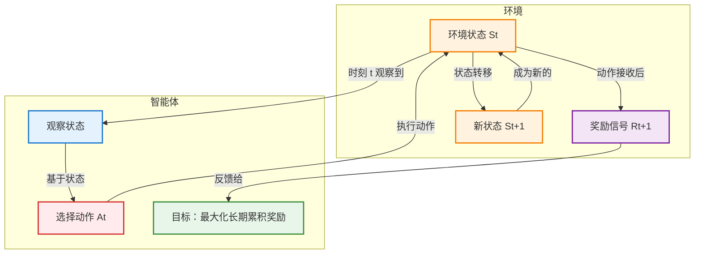

# 强化学习基础概念

## 序贯决策（Sequential Decision Making）

在多个时间步骤或阶段中，决策者（或智能体）根据当前状态和可用信息，逐步做出一系列<mark>相互关联</mark>的决策的过程。

与"一次性决策"不同，序贯决策的核心在于**<mark>动态</mark>性**和**<mark>连续</mark>性**：今天的决定会改变明天的环境，从而影响未来的选择。这一概念是**强化学习（Reinforcement Learning, RL）**、运筹学、控制理论和经济学等领域的基石。

### 核心定义与本质

序贯决策任务通常被建模为一个智能体（Agent）与环境（Environment）持续交互的过程：

- **输入**：智能体在时刻 $t$ 观察到环境的状态 $S_t$
- **动作**：基于状态，<mark>智能体选择一个动作</mark> $A_t$
- **反馈**：<mark>环境</mark>接收动作后，转移到<mark>新状态</mark> $S_{t+1}$，并给出一个<mark>标量奖励信号</mark> $R_{t+1}$
- **目标**：智能体的目标不是最大化当前的即时奖励，而是<mark>最大化**长期累积奖励**</mark>（Cumulative Reward），通常称为回报（Return）

> **关键区别**：在有监督学习中，模型主要进行"预测"（如分类、回归），数据通常是<mark>独立同分布</mark>的；而在序贯决策中，模型进行"决策"，数据是<mark>序列相关</mark>的，且**智能体的动作会直接改变未来数据的分布**。

| 维度 | 有监督学习 | 序贯决策 |
|------|-----------|----------|
| **任务类型** | 预测（分类、回归） | 决策 |
| **数据特性** | 独立同分布 (i.i.d.) | 序列相关 |
| **数据收集方式** | 预先收集的静态数据集 | 通过与环境交互动态生成 |
| **反馈信号** | 标签（正确答案） | 奖励信号（标量，可能延迟） |
| **目标** | 最小化预测误差 | 最大化长期累积奖励 |
| **评估标准** | 准确率、精确率、召回率等 | 累积回报、胜率等 |
| **典型应用** | 图像分类、垃圾邮件过滤 | 游戏 AI、机器人控制、自动驾驶 |

### 四大核心特征

序贯决策任务具有以下显著特点，使其比静态决策更复杂：

1. **动态性 (Dynamicity)**  
   系统状态随时间变化。决策者不能只看眼前，必须考虑动作对后续状态的演化影响。

2. **依赖性 (Dependency)**  
   当前决策依赖于过去的历史（状态轨迹），同时当前的决策又决定了未来的可能性。这是一个连锁反应过程。

3. **不确定性 (Uncertainty)**  
   未来往往是不确定的。动作的结果可能受随机因素干扰（例如：机器人执行"前进"指令可能因打滑而未到达预期位置）。因此，决策通常基于概率模型。

4. **延迟奖励 (Delayed Reward)**  
   这是最棘手的部分。一个动作的好坏可能不会立即显现，需要经过很多步之后才能看到最终结果（例如：围棋中的某一步弃子，可能在几十手后才体现出优势）。这导致了**信用分配问题（Credit Assignment Problem）**：究竟是哪一步决策导致了最终的成功或失败？

### 数学建模：马尔可夫决策过程 (MDP)

在人工智能和强化学习中，序贯决策任务最标准的数学框架是**马尔可夫决策过程 (Markov Decision Process, MDP)**。一个 MDP 由五元组 $(S, A, P, R, \gamma)$ 定义：

- **$S$ (State)**：状态空间，所有可能环境的集合
- **$A$ (Action)**：动作空间，智能体可执行的操作集合
- **$P$ (Transition Probability)**：状态转移概率 $P(s'|s, a)$，表示在状态 $s$ 执行动作 $a$ 后转移到 $s'$ 的概率
- **$R$ (Reward Function)**：奖励函数 $R(s, a, s')$，表示执行动作后获得的即时收益
- **$\gamma$ (Discount Factor)**：折扣因子 ($0 \le \gamma \le 1$)，用于衡量未来奖励的重要性。$\gamma$ 越接近 0，智能体越短视；越接近 1，越重视长远利益

**目标函数**：  
寻找一个策略 $\pi(a|s)$（即在状态 $s$ 下选择动作 $a$ 的概率分布），使得期望累积回报最大化：

$$ G_t = \sum_{k=0}^{\infty} \gamma^k R_{t+k+1} $$

### 主要方法

针对不同的场景和信息完备程度，有多种解决方法：

- **动态规划 (Dynamic Programming, DP)**
  - 适用于已知完整的模型（即知道所有的 $P$ 和 $R$）
  - 通过贝尔曼方程（Bellman Equation）迭代计算最优价值函数
  - 缺点：计算复杂度随状态空间指数级增长（维数灾难）

- **蒙特卡洛方法 (Monte Carlo Methods)**
  - 不需要知道模型，通过与环境交互采样完整的轨迹来估算价值
  - 适用于回合制任务（Episodic tasks）

- **时序差分学习 (Temporal Difference, TD)**
  - 结合了 DP 和蒙特卡洛的优点，不需要完整模型，也不需要等到回合结束，可以单步更新
  - 代表算法：Q-Learning, SARSA

- **深度强化学习 (Deep Reinforcement Learning, Deep RL)**
  - 当状态空间极大（如图像像素）时，使用深度学习神经网络来近似价值函数或策略
  - 代表算法：DQN (Deep Q-Network), PPO (Proximal Policy Optimization), AlphaGo

### 挑战

尽管理论成熟，但在实际应用中仍面临巨大挑战：

1. **探索与利用的权衡 (Exploration vs. Exploitation)**：是尝试新的动作以发现更好的策略（探索），还是坚持当前已知最好的动作（利用）？

2. **高维状态空间**：现实世界状态极其复杂（如自动驾驶的摄像头数据），难以精确建模。

3. **样本效率低**：强化学习通常需要大量的试错数据，这在现实世界（如医疗、机器人）中成本高昂甚至危险。

4. **安全性与鲁棒性**：在训练过程中如何保证智能体不做出灾难性的决策？
